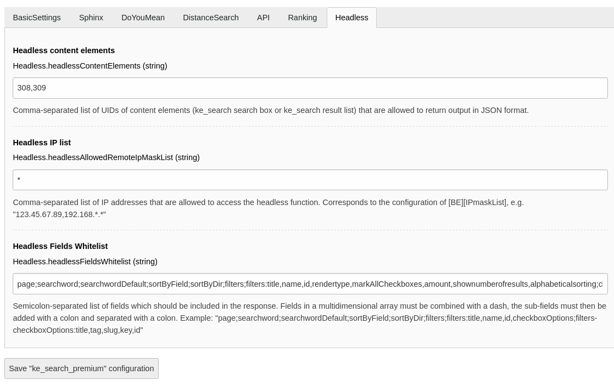
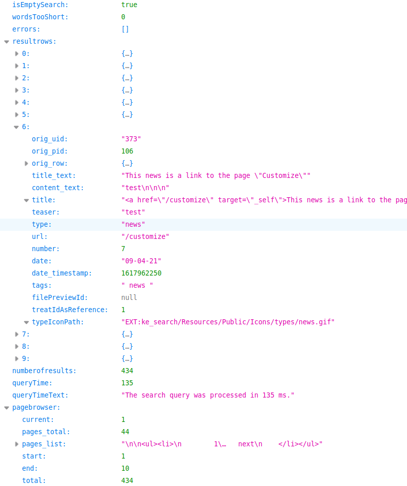
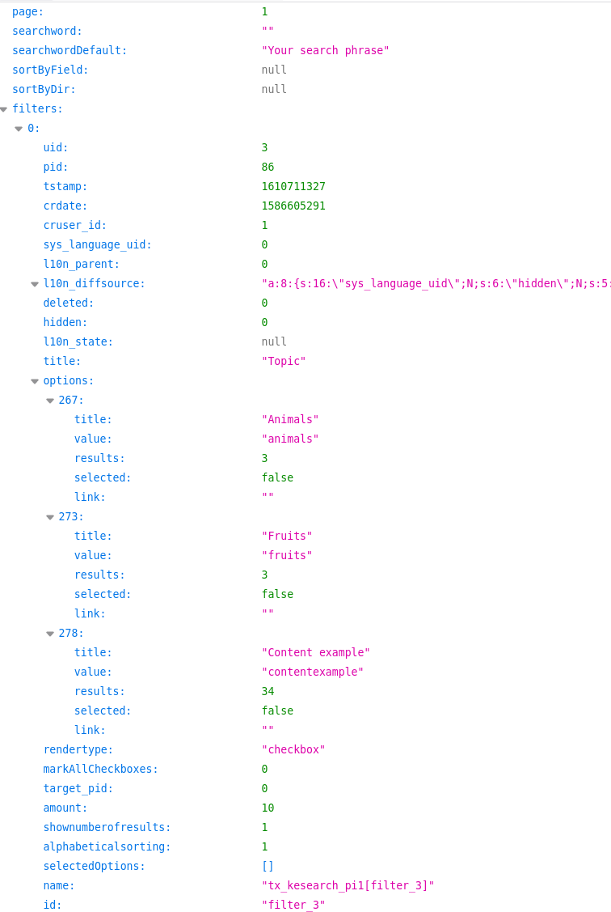

.. ==================================================
.. FOR YOUR INFORMATION
.. --------------------------------------------------
.. -*- coding: utf-8 -*- with BOM.

.. _Headless:

========================================
Headless
========================================

The "headless" feature allows you to receive the output of ke_search in JSON format.

In the extension manager you can specify the UIDs of the ke_search content elements and the IP addresses which
should be allowed to access the headless function.

Use case examples
=================
* Render search results with AJAX.
* Create a headless application and use ke_search in the backend.

Notes
=====
* This feature needs at least ke_search 3.8.1.

Configuration
=============

Please install and configure ke_search, the indexers and the plugins as if you would use ke_search in non-headless
context (see "Quickstart" in the ke_search documentation).

Please use the extension settings module, open the "Headless" tab in the ke_search_premium settings and specify the
UIDs of the ke_search plugins you want to make available for headless response.

Please also specify the IP address(es) from which access to the headless function should be allowed. Although it is
possible to use "*" to make the headless function publicly available, it is recommended to limit the access to only
the IP address of your application, because the response will include full database rows e. g. from the pages table
(in the "orig_row" property) which may disclose information you want to keep private.

You will also need to specify the fields which should be exposed to the public by defining a whitelist. This is a
semicolon-separated list of fields which should be included in the response.
Fields in a multidimensional array must be combined with a dash, the sub-fields must then be added with a colon and
separated with a colon.

Example:

::

  page;searchword;searchwordDefault;sortByField;sortByDir;filters;filters:title,name,id,checkboxOptions;filters-checkboxOptions:title,tag,slug,key,id

There is also a hook which you can use to overwrite the configuration for the headless response. The hook is
called "modifyHeadlessConfiguration". See Class

::

  Classes/Middleware/HeadlessApiMiddleware.php

Usage
=====

You can access the headless function by adding the parameter "tx_kesearch_pi1[headless_ce]" to specify the content
element from which you want to receive the JSON response. The other parameters are the same as you would access
ke_search in non-headless mode. Please add the "no_cache" parameter.

Examples
========

For the following examples we assume that the content element with the UID 308 is our search box plugin and the
UID 309 is our search result plugin.

Default result list
~~~~~~~~~~~~~~~~~~~

Calling the result list plugin without any further parameters will give you the first 10 results (if not configured
otherwise in the plugin settings).

::

  https://my.example.org/?tx_kesearch_pi1[headless_ce]=309&no_cache=1

Search plugin (including filters)
~~~~~~~~~~~~~~~~~~~~~~~~~~~~~~~~~

Calling the search box plugin will give you the search configuration including the filters.

::

  https://my.example.org/?tx_kesearch_pi1[headless_ce]=308&no_cache=1

Searching for a search phrase
~~~~~~~~~~~~~~~~~~~~~~~~~~~~~

::

  https://my.example.org/?tx_kesearch_pi1[headless_ce]=309&tx_kesearch_pi1[sword]=my%20search%20phrase&no_cache=1

Filtering
~~~~~~~~~

You can use the identfiers and values of the filters you get from calling the search box plugin to compile
a search request which includes filtering.

Filtering using a dropdown filter:

::

  https://my.example.org/?tx_kesearch_pi1[headless_ce]=309&tx_kesearch_pi1[filter_11]=syscat84&no_cache=1

Filtering using a checkbox (multiselect) filter:

::

  https://my.example.org/?tx_kesearch_pi1[headless_ce]=309&tx_kesearch_pi1[filter_3_273]=fruits&tx_kesearch_pi1[filter_3_302]=syscat94&no_cache=1

More parameters
===============

You can use all the parameters ke_search supports in the non-headless mode (like sorting, pagebrowser settings etc.):

* sword
* filter
* page
* sortByField
* sortByDir
