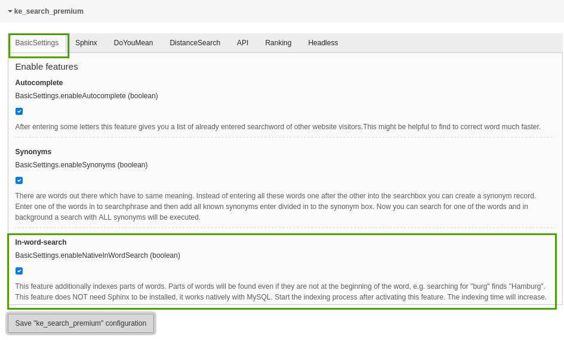
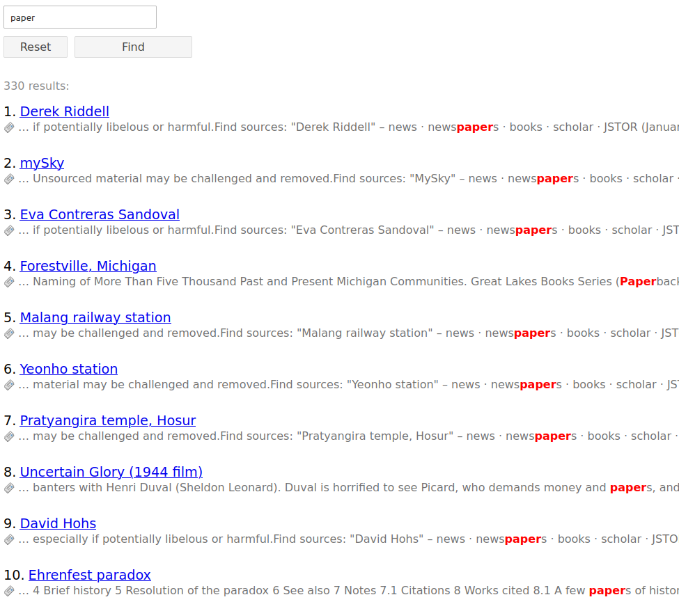

.. ==================================================
.. FOR YOUR INFORMATION
.. --------------------------------------------------
.. -*- coding: utf-8 -*- with BOM.

.. _InWordSearch:

========================================
In-Word-Search
========================================

This feature allows to find searchstrings inside words without the need to install and use Sphinx. Parts of words will
be found even if they are not at the beginning of the word, e.g. searching for "burg" finds "Hamburg".

This feature does **not** need Sphinx to be installed, it works natively with MySQL.

Technical background
====================

This features uses the column "content_hidden" of ke_search (introduced in version 4.5.0) to store partial words which
will then be searched but not shown in the result list.

Use case examples
=================
* Find strings even if they are inside other words, e.g. if someone searches for "store", results with "bookstore" will be found.

Notes
=====
* The indexing time will increase.
* This feature replaces the partial-words-search of the Sphinx feature, so it may result in unexpected behaviour if the "Sphinx"-feature is also activated.
* This feature needs at least ke_search 4.5.0 because in that version the column "content_hidden" has been introduced.

Configuration
=============

You can enable/disable the in-word-search feature in the settings module in the extension configuration in the
tab "Basic Settings".

After that please do a full indexing.

Usage
=====
Use the frontend search box to find words inside other words.

Example
=======
In this example we search for "paper" and find results which contain the word "newspapers".

