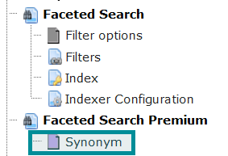
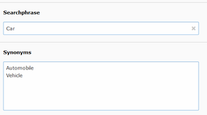

.. ==================================================
.. FOR YOUR INFORMATION
.. --------------------------------------------------
.. -*- coding: utf-8 -*- with BOM.

.. _Synonyms:

========================================
Synonyms
========================================

With this feature, you can add synonyms to certain searchphrases. These
synonyms have to be added by an editor, there are no predefined synonyms.

In a "Synonym" table you can add a searchphrase and some similar words. If someone searches for
"car" you can create a new synonym record to search also for "vehicle" (implemented as an OR combination).
You can add more than one synonym for a given searchphrase.

You have to activate this feature in extension configuration first.

I order to add synonyms, please
- use the "list" module of TYPO3
- go to your search storage page
- add a new record of type "Synonym".

You have to enter each synonym in one line (divided by a line break).

The synonym feature works "back and forth", that means in the following two cases:

- If the entered searchphrase equals <exactly> the „searchphrase“ of your
  synonym record. In this case the synoyms are added to the search query.
- If the entered searchphrase was found <somewhere> in the col ``synonyms`` of
  synonym table. In this case if a synonym was found, ke_search_premium appends
  the word of searchphrase also to searchquery.

*Note that in the search result list synonyms are not highlighted.*

Create a new synonym
--------------------

Searchphrase and synonyms
-------------------------

