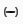
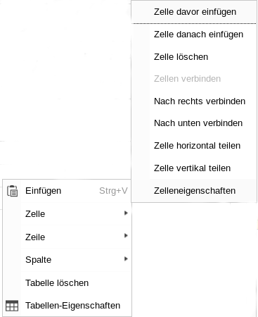

=== Mit der Zwischenablage arbeiten

Die Zwischenablage ist ein nützliches Werkzeug, um ohne größeren Aufwand mehrere Inhaltelemente auszuschneiden oder zu kopieren. Sowohl in dem Modul *Liste* als auch dem Modul *Dateiliste* steht Ihnen die Zwischenablage zur Verfügung.

Es gibt zwei Typen von Zwischenablagen. Der _Einzelauswahlmodus_, bei welchem nur ein Element zwischen
gespeichert werden kann und den _Mehrfachauswahlmdous_, bei dem mehrere Elemente zwischengespeichert werden können.
Standardmäßig gibt es eine Zwischenablage für den _Einzelauswahlmodus_ und drei Zwischenablagen für den _Mehrfachauswahlmodus_. Damit die Zwischenablage angezeigt wird, muss der Haken in der Auswahlbox *Zwischenablage anzeigen* gesetzt sein.

Dann kann mit Klick auf  ein Element in die Zwischenablage kopiert werden oder mit Klick auf image:img/icons/actions/actions-edit-cut.svg[scaledwidth="12"] ein Element per Ausschneiden in die Zwischenablage eingefügt werden. Im Mehrfachauswahlmodus
werden bei den einzelnen Elementen zusätzliche Kästchen angezeigt, mit welchen die Elemente, die kopiert werden sollen, markiert werden können.

Mit Klick auf image:img/icons/actions/actions-document-select.svg[scaledwidth="12"] können alle Elemente in einer Tabelle markiert werden. Mit Klick auf  im Tabellenkopf werden die markierten Elemente in die Zwischenablage übernommen. Um die Elemente aus der Zwischenablage wieder einzufügen, müssen Sie an der gewünschten Stelle im Tabellenkopf auf das Icon  klicken.

image::img/glossar/clipboard.png[width=600]

=== Seitentypen

[cols="20,80"]
|===
a|image:img/icons/types/apps-pagetree-page-default.svg[scaledwidth="12"]|Normale Standard Seite.
a|image:img/icons/types/apps-pagetree-page-shortcut.svg[scaledwidth="12"] |Seitentyp _Shortcut_. Dieser Seitentyp verweist auf eine andere Seite.
a| |Normale Standard Seite (etwas heller als oben), bei welcher die Option _im Menü verstecken_ ausgewählt wurde. Die Seite wird im Menü nicht angezeigt, kann aber ganz normal über einen Link aufgerufen werden.
a|image:img/icons/types/apps-pagetree-page-hidden.png[scaledwidth="12"] |Verborgene Seite. Seiten diesen Typs sind im Frontend nicht aufrufbar, können jedoch im Backend bearbeitet werden.
a| |Seitentyp _Ordner_. Dieser Seitentyp kann zur Speicherung von Datensätzen genutzt werden. Er wird nicht im Frontend angezeigt.
|===

=== Symbole im Arbeitsbereich

[cols="20,80"]
|===
| Mit diesem Symbol ... |... lösen Sie diese Aktion aus:
a|image:img/icons/actions/actions-view-page.svg[scaledwidth="12"] |Zeigt die Vorschau der jeweiligen Seite in einem neuem Fenster an.
a| |Öffnet die Bearbeitungsansicht der Seiteneigenschaften.
a|image:img/icons/actions/actions-add.svg[scaledwidth="12"] |Legt eine neue Seite an.
a|image:img/icons/actions/actions-document-info.svg[scaledwidth="12"] |Zeigt verschiedene Informationen über die Seite an.
a|image:img/icons/actions/actions-search.svg[scaledwidth="12"] |Öffnet ein Suchformular für die Suche nach Datensätzen auf der aktuellen Seite (optional inkl. Unterseiten).
a|image:img/icons/actions/actions-open.svg[scaledwidth="12"] |Öffnet die Bearbeitungsansicht des Inhaltselements.
a| |Schaltet zwischen den Zustände _sichtbar_ und _unsichtbar_ hin und her.
a| |Kopiert das Element in die augewählte Zwischenablage.
a|image:img/icons/actions/actions-edit-cut.svg[scaledwidth="12"] |Schneidet das Element aus.
a|image:img/icons/actions/actions-document-history-open.svg[scaledwidth="12"] |Zeigt vorgenommene Änderungen an der Seite an und ermöglicht es, einzelne oder mehrere dieser rückgängig zu machen.
a|image:img/icons/actions/actions-system-cache-clear.svg[scaledwidth="12"] |Löscht den Frontend Cache der Seite.
a|image:img/icons/actions/actions-edit-delete.svg[scaledwidth="12"] |Löscht ein Inhaltselemente oder eine Seite.
a|image:img/icons/actions/actions-document-save.svg[scaledwidth="12"] |Speichert die eingegebenen Daten.
a| |Öffnet den Link Wizard.
a| |Öffnet den Dateibrowser.
a|image:img/icons/actions/actions-calendar.svg[scaledwidth="12"] |Öffnet ein Kalenderblatt zur Wahl eines Datums.
|===

=== Symbole im Rich Text Editor (RTE)

[cols="20,80"]
|===
|Mit diesem Symbol |...lösen Sie diese Aktion aus:
a| |Der markierte Text wird in Fettschrift ausgezeichnet.
a| |Der markierte Text wird in Kursivschrift ausgezeichnet.
a| |Der markierte Text wird tiefgestellt.
a|image:img/glossar/rte/SupIcon.png[] |Der markierte Text wird hochgestellt.
a|image:img/glossar/rte/NumListIcon.png[] |Fügt eine nummerierte Liste ein.
a| |Fügt eine unnummerierte Liste ein.
a| |Erzeugt einen Zitatblock.
a|image:img/glossar/rte/AlignLeftIcon.png[] |Text linksbündig anordnen.
a|image:img/glossar/rte/AlignCenterIcon.png[] |Text zentriert anordnen.
a|image:img/glossar/rte/AlignRightIcon.png[] |Text rechtsbündig anordnen.
a|image:img/glossar/rte/AlignEquIcon.png[] |Text im Blocksatz anordnen.
a|image:img/glossar/rte/LinkIcon.png[] |Fügt für den markierten Text einen Verweis (Link) ein.
a| |Entfernt für den markierten Text den Verweis (Link).
a| |Ausschneiden des markierten Bereichs.
a|image:img/glossar/rte/CopyIcon.png[] |Kopieren des markierten Bereichs.
a|image:img/glossar/rte/InsertIcon.png[] |Standardmäßge Einfüge Option mit Übernahme der Formatierung.
a|image:img/glossar/rte/InsWoForIcon.png[] |Nur der reine Text wird eingefügt und sämtliche Formatierungen werden verworfen.
a|image:img/glossar/rte/WordIcon.png[] |Entfernt Formatierungen aus dem Word.
a| |Entfernt Formatierungen aus dem Text.
a|image:img/glossar/rte/BackIcon.png[] |Macht den letzten Editierschritt rückgängig.
a|image:img/glossar/rte/ForwardIcon.png[] |Stellt den letzen Editierschritt wieder her.
a|image:img/glossar/rte/SpellIcon.png[] |Führt eine Rechtschreibprüfung durch.
a|image:img/glossar/rte/LaTexIcon.png[] |Ermöglicht es, Formeln im TeX-Format einzufügen.
a| |Fügt eine Tabelle ein.
a|image:img/glossar/rte/LineIcon.png[] |Fügt eine horizontale Linie ein.
a|image:img/glossar/rte/SpecIcon.png[] |Fügt ein Sonderzeichen aus den Bereichen "allgemein", "mathematisch", oder "Formen und Farben" ein.
a| |Fügt ein bedingtes Trennzeichen ein.
a|image:img/glossar/rte/MaxIcon.png[] |Maximiert den Texteditor.
a| |Schaltet in den Quelltextmodus, um das HTML selbst anzuschauen und/oder zu bearbeiten.
|===

=== Tabellen mit dem RTE
Spezielle Tabellenfunktioen (Zeile/Spalte einfügen/entfernen) sind über das Kontextmenü (rechte Maustaste) innerhalb einer Tabelle erreichbar. Über die *Tabellen-Eigenschaften* können z.B. die Stärke des Rahmens (Rahmengröße - Dezimalwert) sowie die Kopfzeile der Tabelle bestimmt werden.

[frame="none",border="none",stripe="none",grid="rows",cols="50,50"]
|===
a| a|image:img/glossar/table/table-properties.png[width=200]
|===

Die Farbe einer Zelle können Sie im Kontextmenü über _Zelle_ und dann _Zelleneigenschaften_ festlegen. Mit Klick auf _Zelleneigenschaften_ öffnet sich ein kleines Fenster, in welchem dann die Hintergrundfarbe und die Rahmenfarbe der ausgewählten Zelle explizit bestimmt werden kann.

[frame="none",border="none",stripe="none",grid="rows",cols="50,50"]
|===
a| a|
|===

