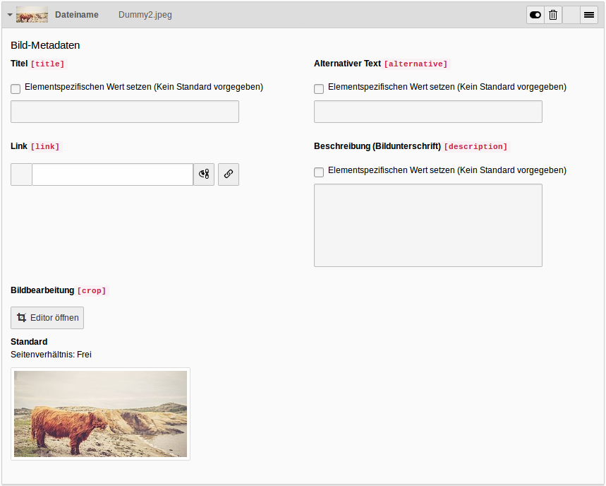

=== Symbole im Inhaltsbereich

* image:img/icons/actions/actions-view-page.svg[scaledwidth="12"]: Zeigt die aktuelle Seiten im Frontend an

* image:img/icons/actions/actions-version-page-open.svg[scaledwidth="12"]: Öffnet das Seiteneigenschaften Formular

* image:img/icons/actions/actions-search.svg[scaledwidth="12"]: Öffnet das Suchformular, mit welchem nach Inhaltselementen gesucht werden kann

* : Löscht den Cache der aktuell ausgewählten Seiten

=== Inhaltselemente hinzufügen

Inhaltselemente besitzen mehrere Felder, welche bearbeitet werden können. Die Felder dienen dazu, dass Inhaltselement zu konfigurieren und mit Text und Bildern zu befüllen, um so die gewünschte Ausgabe im Frontend zu erzielen.

Um Inhaltselemente anzulegen, wählen Sie in der Modulleiste das Modul *Web* -> *Seite* aus. Navigieren Sie im Seitenbaum zu der Seite, auf welcher Sie das Inhaltselement anlegen möchten. Im Arbeitsbereich wird der strukturelle Aufbau mit eventuell schon vorhandenen Inhaltselementen angezeigt.

Wählen Sie den Bereich, an welchem Sie das Inhaltselement einfügen möchten aus, indem Sie dort auf das 
klicken. Je nach gewähltem Bereich und Benutzerrechten können Sie nun zwischen verschiedenen Inhaltselement wählen. Meistens gibt es noch verschiedene Tabs, in welchen Inhaltselemente unterschiedlichen Typs angezeigt werden (z.B. Elemente für Menüs oder Plug-Ins) Klicken Sie auf das Inhaltselement, das Sie einfügen möchten. Dadurch öffnet sich das Eingabeformular, in welchem zum Beispiel Überschriften, Text und Bilder eingefügt werden können.

=== Inhaltselemente kopieren

[frame="none",border="none",stripe="none",grid="rows",cols="70,>30"]
|===
|Wird ein Inhaltselment kopiert und an einer neuen Position eingefügt, ist dieses neue Inhaltselement vollkommen unabhängig von seinem Ursprungselement. Das bedeutet, dass es bei einer Anpassung des Ursprungselements zu keinen Auswirkungen auf die Kopie kommt. Dies gilt ebenso umgekehrt.
Klicken Sie mit der *rechten Maustaste* bei einem Inhaltselement auf das jeweilige Icon des Inhaltselements. Dadurch öffnet sich das Kontextmenü.

Wählen Sie hier die Option image:img/icons/actions/actions-edit-copy.svg[scaledwidth="12"] *Kopieren* aus. Sie können dieses kopierte Element auf jeder Seite an gewünschter Position einfügen. Wechseln Sie dazu an die Stelle, an der die Kopie eingefügt werden soll. Klicken Sie auf  und anschließend auf *Kopie einfügen*. | image:img/contentelements/copy.png[width=120]
|===

=== Inhaltselemente ausschneiden

Klicken Sie mit der *rechten Maustaste* bei einem Inhaltselement auf das jeweilige Icon des Inhaltselements.
Um das Element auszuschneiden, klicken Sie auf image:img/icons/actions/actions-edit-cut.svg[scaledwidth="12"] *Ausschneiden* im sich öffnenden Kontextmenü. Sie können das ausgeschnittene Element auf jeder Seite an der gewünschten Position einfügen. Klicken Sie auf , um das Inhaltselement einzufügen.

=== Inhaltselemente verbergen

Klicken Sie mit der *rechten Maustaste* bei einem Inhaltselement auf das jeweilige Icon des Inhaltselement.
Um das Inhaltselement im Frontend zu verbergen, klicken Sie image:img/icons/actions/actions-edit-hide.svg[scaledwidth="12"] *Deaktivieren* im Kontextemenü.

=== Inhaltselemente löschen

Klicken Sie mit der rechten Maustaste bei einem Inhaltselement auf das jeweilige Icon des Inhaltselement. Um das Inhaltselement zu löschen, klicken sie image:img/icons/actions/actions-edit-delete.svg[scaledwidth="12"] *Löschen* im Kontextmenü.
Bestätigen Sie die Rückfrage mit Klick auf *Löschen*.

ifdef::grid[]

=== Gridelements

Gridelements dienen als Behälter für weitere Inhaltelemente. Sie werden zum Beispiel dazu benutzt, wenn im Frontend mehrspaltige Layouts verwendet werden. Die zur Auswahl stehenden Gridelemente stehen im Tab *Gridelements* zur Verfügung.

endif::[]

=== Links anlegen

.Linkfeld innerhalb eines Inhaltselements
image::img/contentelements/linkfield.png[]

[frame="none",border="none",stripe="none",grid="rows",cols="40,>60"]
|===
|Mit Klick auf image:img/icons/actions/actions-wizard-link.svg[scaledwidth="12"] öffnet sich das Linkauswahlfenster. In diesem Fenster gibt es fünf Tabs, die je nach gewünschter Art des Links benutzt werden. Falls ein Link auf eine Seite innerhalb des Seitenbaums angelegt werden soll, muss man im Tab *Seite* im Seitenbaum die passende Seite auswählen. Wenn auf eine Datei verlinkt werden soll, muss im Tab *Datei* die gewünschte Datei ausgewählt werden.

Falls diese noch nicht hochgeladen wurde, kann man dies ebenso vornehmen. Um einen Link auf einen Ordner zu setzen, können Sie im Tab *Ordner* den passenden Ordner auswählen oder einen neuen Ordner anlegen. Wenn Sie einen Link auf eine externe Seite einfügen möchten, wählen Sie den Tab *Externe URL* aus. Dort können Sie im Textfeld URL die passende URL einfügen. Klicken Sie abschließend auf *Link setzen*.

Wollen Sie einen Link zum Verfassen einer E-Mail einfügen, können Sie im Tab *E-Mail* im Feld E-Mail-Adresse die jeweilige Addresse einfügen. Um die Eingabe zu bestätigen, klicken Sie abschließend auf *Link setzen*. a|

.Linkauswahlfenster im Tab *Seite*
image::img/contentelements/link.png[width=350]
.Linkauswahlfenster im Tab *Externe URL*

|===

=== Mit dem Rich Text Editor (RTE) arbeiten

RTE steht für Rich Text Editor. Der RTE wird bei bestimmten Inhaltselementen für längere Texteingaben verwendet. Prinzipiell funktioniert er ähnlich wie ein Textverarbeitungsprogramm wie etwa Microsoft Word. Je nach Konfiguration können verschiedene Formatierungen über die einzelnen Schaltflächen vorgenommen werden. So kann zum Beispiel die Schrift fett oder kursiv dargestellt werden. Die Bedeutung der einzelnen Schaltflächen ist im Glossar aufgeführt.

.RTE Feld
image::img/contentelements/rte.png[width=450]

=== Eine Mediendatei hinzufügen

[frame="none",border="none",stripe="none",grid="rows",cols="40,>60"]
|===
|Bei einigen Inhaltselementen ist es möglich, eine Mediendatei (Bild, Audio-Track, Video) hinzuzufügen. Wählen Sie dazu im Inhaltselement den Tab *Bilder* oder *Medien* aus. Dort können Sie über den Button image:img/icons/actions/actions-folder.svg[scaledwidth="12"] *Bild hinzufügen* oder *Mediendatei hinzufügen* eine Datei aus dem Dateienbaum auswählen. Der Dateienbaum befindet sich links.

Der Inhalt des ausgewählten Ordners ist im Bereich rechts davon zu sehen. Dort haben Sie außerdem die Möglichkeit, Dateien hochzuladen und einen neuen Order anzulegen (falls Sie die notwendigen Redakteursrechte besitzen).
Über den Button image:img/icons/actions/actions-edit-upload.svg[scaledwidth="12"] *Dateien auswählen und hochladen* können Sie eine direkt ein Bild von ihrem PC hochladen. Dieses landet standardmäßig im Ordner *user_upload*.
Unter _Erlaubte Dateierweiterungen_ können Sie außerdem sehen, welche Dateienarten benutzt werden können. Die erlaubten Dateiformate werden dabei in grünen Boxen angezeigt.

Wenn Sie ein Bild eingefügt haben, können Sie dort einen Titel, einen alternativen Text (welcher z.B. im Screenreader für Sehbehinderte vorgelesen wird), und eine Beschreibung hinterlegen. Unter *Bildbearbeitung* können mit Klick auf image:img/icons/actions/actions-crop.svg[scaledwidth="12"] *Editor öffnen*, das Bild zuschneiden. Dabei können Sie entweder ein vorgegebenes Seitenverhältnis auswählen oder das Bild selbst manuell zurechtschneiden. Im Frontend wird schließlich nur der eingegrenzte Bereich angezeigt. Eventuell wird auch die Wahl einer sog. Focus-Area angeboten. Damit können Sie festlegen, welcher Bereich des Bildes bei einem eventuellen automatischen Zuschnitt für das Frontend auf jeden Fall sichtbar sein soll. Um das Bildbearbeitungsfenster wieder zu schließen, klicken Sie abschließend auf image:img/icons/actions/actions-document-save.svg[scaledwidth="12"] *Akzeptieren*. a|

.Buttons, um Bilder hinzufügen oder hochladen plus erlaubte Dateiarten
image::img/contentelements/images.png[width=350]
.Metadaten eines Bildes

.Bildeditor, um ein Bild zurechtzuschneiden

|===

=== Ein Bild löschen

Um ein Bild zu löschen, klicken Sie auf image:img/icons/actions/actions-edit-delete.svg[scaledwidth="12"]. Bestätigen Sie die Sicherheitsrückfrage mit *Ja, diesen Datensatz löschen*.

WARNING: Das Bild wird lediglich aus dem jeweiligen Inhaltselement gelöscht, bleibt jedoch im Dateienordner vorhanden. Wenn Sie das Bild innerhalb des Modul *Dateiliste* löschen, wird es wirklich gelöscht.

