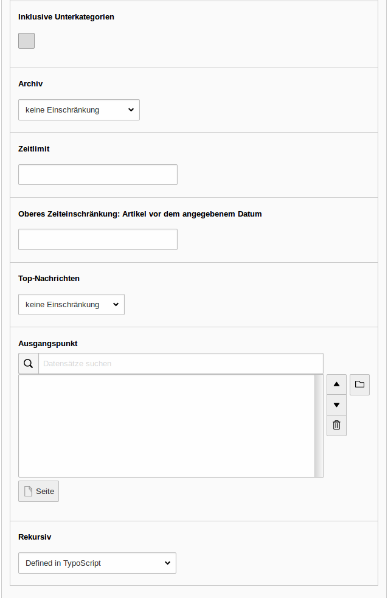

=== Nachrichten System Listenansicht

NOTE: Voraussetzung ist, dass die Extension _news_ installiert ist.

[frame="none",border="none",stripe="none",grid="rows",cols="40,>60"]
|===
a|Verwenden Sie dieses Plugin, wenn Sie aktuelle Artikel in einer Listenansicht darstellen möchten.
Wählen Sie hierfür *Nachrichten-System* unter dem Tab _Plug-Ins_ aus.

Im Tab _Plug-In_ können Sie das Plugin konfigurieren.

Dort finden Sie unter *Erweiterungsoptionen* wiederum folgende drei Tabs:

* _Einstellungen_
* _Weitere Einstellungen_
* _Vorlage_

a|
|===

[frame="none",border="none",stripe="none",grid="rows",cols="50,50"]
|===
a|Im Tab _Einstellungen_ können folgende Einstellungen vorgenommen werden:

* *Ausgabemodus:* Wählen Sie *Listenansicht* in der Auswahlliste aus, um die aktuellsten Artikel in der Listenansicht darzustellen.
* *Sortieren nach:* Wählen Sie *Angegebenes Datum/Uhrzeit* aus, um die Artikel nach dem Datum sortiert auszugeben.
* *Sortierung:* Wählen Sie *absteigend* aus, um die Artikel vom aktuellsten Artikel absteigend auszugeben.
* *Kategoriemodus:*
** Nicht berücksichtigen, alle Nachrichten anzeigen (ignoriere folgende Auswahl).
** Zeige Nachrichten mit den ausgewählten Kategorien (ODER): Es werden nur Nachrichten angezeigt, die mindestens einer der ausgewählten Kategorien oder Unterkategorien zugeordnet sind. Ist einer Nachricht eine weitere Kategorie zugeordnet, die nicht ausgewählt wurde, wird sie trotzdem, angezeigt.
** Zeige Nachrichten mit den ausgewählten Kategorien (UND): Es werden nur Nachrichten angezeigt, die allen ausgewählten Kategorien oder Unterkategorien zugeordnet sind.
** Zeige KEINE Nachrichten aus den ausgewählten Kategorien (ODER): Nachrichten, die mindestens einer der ausgewählten Kategorie oder Unterkategorie zugeordnet sind, werden nicht angezeigt.
** Zeige KEINE Artikel aus den ausgewählten Kategorien (UND): Nachrichten, die alle ausgewählten Kategorien oder Unterkategorien zugeordnet sind, werden nicht angezeigt.
** Inklusive Unterkategorien: Wählen Sie ggf. die Checkbox aus.

a|

* *Kategoriemodus* (weiter)
** Archiv:
*** Wählen Sie Archivierte aus der News-Archiv-Seite.
*** Wählen Sie ansonsten keine Einschränkung aus.
** Obere Zeitbeschränkung: Artikel vor dem angegebenen Datum.
** Untere Zeitbeschränkung: Artikel nach dem angegebenen Datum.
** Top-Nachrichten: Sie können entweder die Anzeige von Top-Nachrichten aktivieren oder deaktivieren.
** Ausgangspunkt: Klicken Sie auf image:img/icons/actions/actions-folder.svg[scaledwidth="12"], um den Dateibrowser zu öffnen und wählen Sie den Ordner im Seitenbaum, von welchem die Artikel ausgegeben werden sollen.
|===

[frame="none",border="none",stripe="none",grid="rows",cols="50,50"]
|===
a| Im Tab _Weitere Einstellungen_ können folgende Einstellungen vorgenommen werden:

* *Seiten-ID für Einzelnachrichten-Ansicht:* Klicken Sie auf image:img/icons/actions/actions-folder.svg[scaledwidth="12"], um den Dateibrowser zu öffnen und wählen Sie die Seite aus, auf welcher die einzelnen Artikel in der Detailansicht ausgegeben werden sollen.
* *Seiten-ID Listenansicht:* Klicken sie auf image:img/icons/actions/actions-folder.svg[scaledwidth="12"], um die Seite auszuwählen, auf welcher die Listenansicht ausgegeben werden soll.
* *Seiten-ID für "Zurück"-Link* Klicken Sie auf image:img/icons/actions/actions-folder.svg[scaledwidth="12"], um den Dateibrowser zu öffnen und wählen Sie die Seite aus, auf welche zurück gesprungen werden soll, wenn ein Nutzer auf der Detailansicht eines Artikels auf den Zurück-Link klickt.
* *Maximale Anzahl anzuzeigender Datensätze:* Bestimmen Sie hier maximale Anzahl an Artikel, welche  angezeigt werden soll.
* *Beginnend mit Nachrichtenelement:* Auswahl, ab welchem Nachrichtenelement die Listenansicht begonnen werden soll.
* *Schlagworte:* Hier können Nachrichten-Tags ausgewählt werden, nach welchen die Artikel gefiltert werden sollen.
* *Paginierung ausblenden:* Auswahl, ob die Seitenauswahl deaktiviert werden soll, wenn die Listenansicht auf mehrere Seiten aufgeteilt ist.
* *Einträge pro Seite*: Eintrag limitiert die angezeigten Artikel pro Seite
* *"Top-Nachrichten" oberhalb:* Wenn angekreuzt, wird die "Top-Nachricht" immer oben angezeigt
* *Bereits angezeigte Nachrichten ausschließen:* Bereits angezeigte Nachrichten werden nicht mehr aufgenommen, wenn die Checkbox aktiviert ist
* *Überschreiben von Plugin-Einstellungen deaktivieren*

a|
image:img/news/ListView2_2.png[width=280]
|===

[frame="none",border="none",stripe="none",grid="rows",cols="50,50"]
|===
a| Im Tab _Vorlage_ können folgende Einstellungen vorgenommen werden:

* *Maximale Breite und Höhe von Medienelementen:* Bestimmen Sie hier die maximale Bildgröße in Pixeln.
* *Länge des Teasers:* Bestimmen Sie hier die maximale Länge des Teasers in Zeichen.
* *Template-Layout:* Hier wird das Template für die Ausgabe der Artikel im Frontend definiert.

Klicken Sie abschließend zuerst auf

image:img/icons/actions/actions-document-save.svg[scaledwidth="12"] Speichern und dann auf image:img/icons/actions/actions-message-ok-close.svg[scaledwidth="12"] Schließen.

a|
|===

=== Nachrichten System Detailansicht

[frame="none",border="none",stripe="none",grid="rows",cols="50,50"]
|===
a|Verwenden Sie dieses Plugin, wenn Sie aktuelle Artikel in einer Listenansicht darstellen möchten.
Wählen Sie hierfür *Nachrichten-System* unter dem Tab _Plug-Ins_ aus.

Im Tab _Plug-In_ können Sie das Plugin konfigurieren.

Dort finden Sie unter *Erweiterungsoptionen* wiederum folgende drei Tabs:

* _Einstellungen_
* _Weitere Einstellungen_
* _Vorlage_

Im Tab _Einstellungen_ können folgende Einstellungen vorgenommen werden:

* *Ausgabemodus:* Wählen Sie Detailansicht im Auswahlfeld aus.
* *Ausgangspunkt:* Klicken Sie auf image:img/icons/actions/actions-folder.svg[scaledwidth="12"], um den Dateibrowser zu öffnen und wählen Sie den Ordner, aus welchem die Artikel ausgewählt werden sollen, aus.

a|
|===

[frame="none",border="none",stripe="none",grid="rows",cols="50,50"]
|===
a|Im Tab _Weitere Einstellungen_ können folgende Einstellungen vorgenommen werden:

* *Seiten-ID für Einzelnachrichten-Ansicht:* Klicken Sie auf image:img/icons/actions/actions-folder.svg[scaledwidth="12"], um den Dateibrowser zu öffnen und wählen Sie die Seite, welche für die Detailseitenansicht genutzt werden soll.
* *Seiten-ID für "Zurück"-Link:* Klicken Sie auf image:img/icons/actions/actions-folder.svg[scaledwidth="12"], um den Dateibrowser zu öffnen und wählen Sie die Seite aus, auf welche zurück gesprungen werden soll, wenn ein Nutzer auf der Detailansicht eines Artikels auf den Zurück-Link klickt.

a|image:img/news/DetailView2.png[width=280]
|===

[frame="none",border="none",stripe="none",grid="rows",cols="50,50"]
|===
a|Im Tab _Vorlage_ können folgende Einstellungen vorgenommen werden:

* *Maximale Breite und Höhe von Medienelementen:* Bestimmen Sie hier die maximale Bildgröße in Pixeln.
* *Template-Layout*: Hier wird das Template für die Ausgabe der Artikel im Frontend definiert.

Klicken Sie abschließend zuerst auf image:img/icons/actions/actions-document-save.svg[scaledwidth="12"] Speichern und dann auf image:img/icons/actions/actions-message-ok-close.svg[scaledwidth="12"] Schließen.

a|
|===

