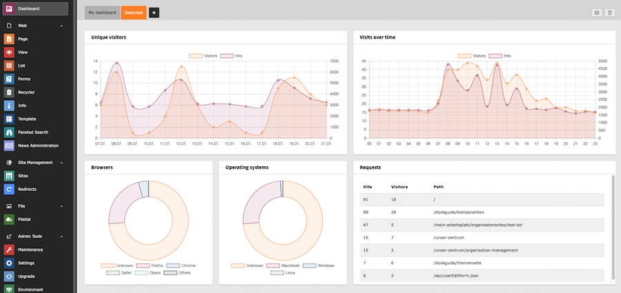
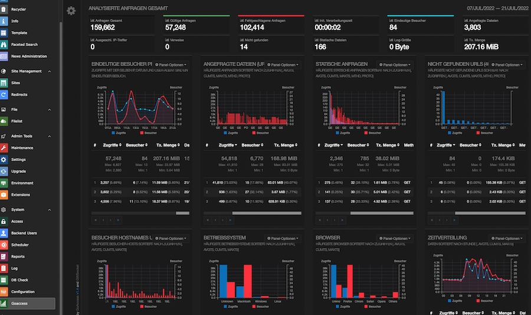

# TYPO3 goaccess.io integration

This TYPO3 extensions shipps Dashboard widgets and a backend module to display various [goaccess.io](https://goaccess.io) metrics.







## Installation

```
composer require xima/xm-goaccess
```

* [Install and configure goaccess](https://goaccess.io/get-started) to generate json and/or html output to a directory
* Make sure the webserver user has read access to the generated files

## Configuration

To enable the backend module, set the path to the generated html via extension configuration:

```
$GLOBALS['TYPO3_CONF_VARS']['EXTENSIONS']['xm_goaccess']['html_path] = '/tmp/goaccess/goaccess.html';
```

To make the new dasboard widgets work, you need to pass the path to the generated json file:

```
$GLOBALS['TYPO3_CONF_VARS']['EXTENSIONS']['xm_goaccess']['json_path] = '/tmp/goaccess/goaccess.json';
```