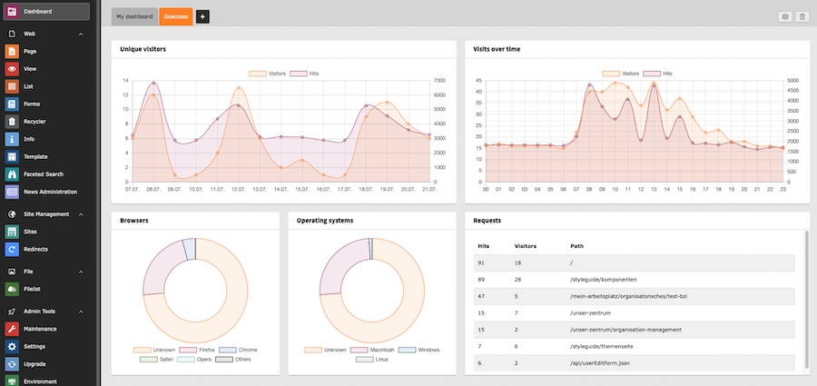
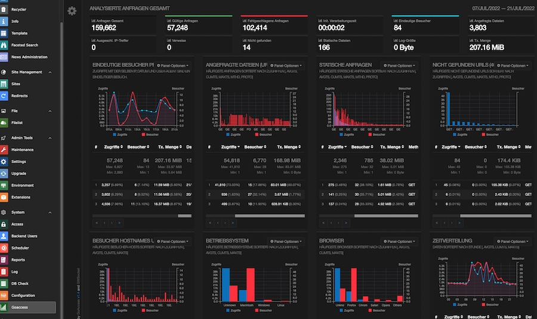
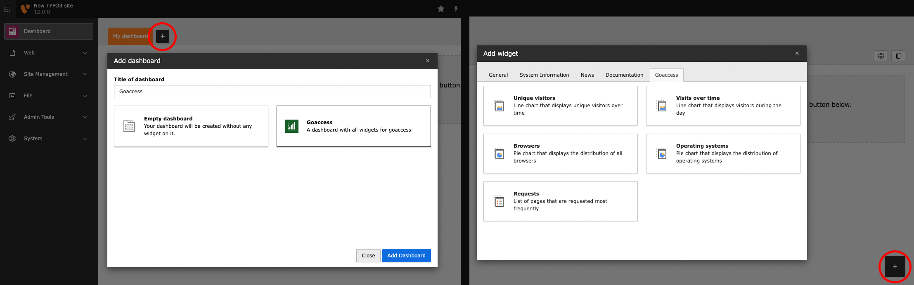

# TYPO3 goaccess.io integration

Goaccess is an open source log analyzer which extracts metrics from a multitude
of web log formats and visualizes them in your terminal or as html. Metrics can
be exported to json and csv.
This TYPO3 extensions ships Dashboard widgets and a backend module to display
various [goaccess.io](https://goaccess.io) metrics.





## Installation

```
composer require xima/xm-goaccess
```

* [Install and configure goaccess](https://goaccess.io/get-started) to generate
  json and/or html output to a directory
* Make sure the webserver user has read access to the generated files

## Configuration

To enable the backend module, set the path to the generated html via extension
configuration:

```
$GLOBALS['TYPO3_CONF_VARS']['EXTENSIONS']['xm_goaccess']['html_path] = '/tmp/goaccess/goaccess.html';
```

To make the new dasboard widgets work, you need to pass the path to the
generated json file:

```
$GLOBALS['TYPO3_CONF_VARS']['EXTENSIONS']['xm_goaccess']['json_path] = '/tmp/goaccess/goaccess.json';
```

## Usage

You can add single widgets to your custom dashboard or use the preset that
creates a new dashboard with all available goaccess integrations.



### Goaccess installation on Debian/Ubuntu:

The application is written in go and available from the standard repositories of
multiple Linux distributions. A repository for Debian/Ubuntu is also provided.
See the [official goaccess.io documentation[(https://goaccess.io/get-started)
for a complete guide.

```
apt install goaccess
```

HTML and JSON exports for the TYPO3 extension can be generated from Apache logs
as follows:

```
usr/bin/zcat --force /var/log/apache2/access_example.org.log* | \ # You usually want to parse rotated and gzipped logs as well.
    /usr/bin/goaccess -
    -o goaccess.html -o goaccess.json                           \ # Export processed metrics as html and json.
    --log-format=COMBINED                                       \ # Apache Combined Log Format. Custom log formats are supported, too.
    --ignore-crawlers                                           \ # Ignore web crawlers.
    --exclude-ip ::1 --exclude-ip 127.0.0.1                     \ # Exclude status checks originating from local ip addresses.
```

To refresh these files periodically, you might use a cronjob, e.g.:

```
*/15 * * * /usr/bin/mkdir -p /tmp/goaccess; chmod 750 /tmp/goaccess; /home/user/goaccess-generation.sh
```
