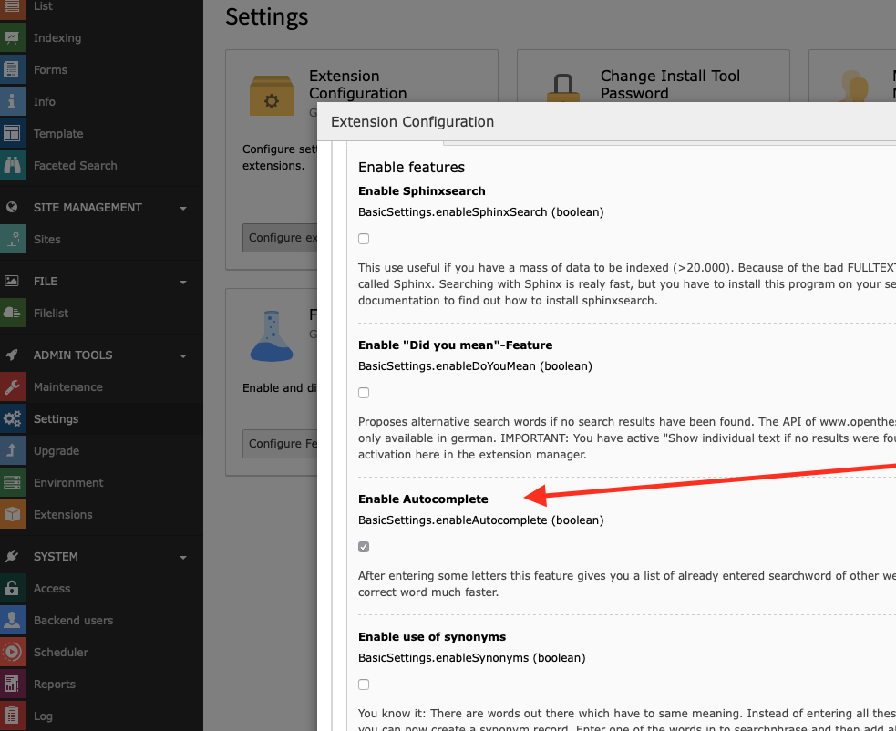

.. ==================================================
.. FOR YOUR INFORMATION
.. --------------------------------------------------
.. -*- coding: utf-8 -*- with BOM.

.. _Autocomplete:

========================================
Autocomplete
========================================

The autocomplete features proposes searchwords as the user begins to type.

The phrases proposed in the autocomplete feature are taken from real search words other
users used. Only phrases which gave results in past are proposed. The words are taken from the search word
statistics table.

To activate this feature you have to mark the checkbox „use statistics“ on first tab of
the ke_search plugin (activated by default). With each search the statistics table will grow and more and more
results will appear in the autocomplete function.

This feature only works if you insert the searchbox as a plugin on a TYPO3 page, not if
you create a searchbox via typoscript.

For all versions greater than 3.0.0 ke_search_premium does not use jQuery anymore to implement the
autocomplete feature but implements it in "vanilla javascript".

Configuration
=============

You can enable/disable the autocomplete feature in the settings module in the extension configuration.

After enabling the checkbox for autocomplete and a „clear cache“ the needed typoscript files will be included
automatically, there's no need to add a template manually.

Adding your own autocomplete words
----------------------------------

If you want to add your own words to the list of proposed words, please have a look at

::

  Classes/Middleware/Autocomplete.php

There's a hook to include your Code (search for "modifyAutocompleWordList").

Configuration options
---------------------

These are the configuration options for plugin.tx_kesearchpremium_pi1:

=================== ======= =============================================== =======================
Value               Type    Description                                     Default
=================== ======= =============================================== =======================
amount              Integer If autocomplete finds a mass of records it's    10
                            better to reduce the results in selectbox to
                            a lower one. In normal cases 10 results
                            should be enough, but if you want you can
                            change this value here
=================== ======= =============================================== =======================

Note on javascript and css files
--------------------------------

After activating this feature in the extension manager, two static typoscript files will be included
automatically:

::

  typo3conf/ext/ke_search_premium/static/autocomplete/constants.txt
  typo3conf/ext/ke_search_premium/static/autocomplete/setupt.txt

In the setup.txt file one CSS and several external javascript files are included which are needed for the
autocomplete function. If the autocomplete feature does not work as expected, make sure those don't conflict with your
usage of CSS and javascript.
