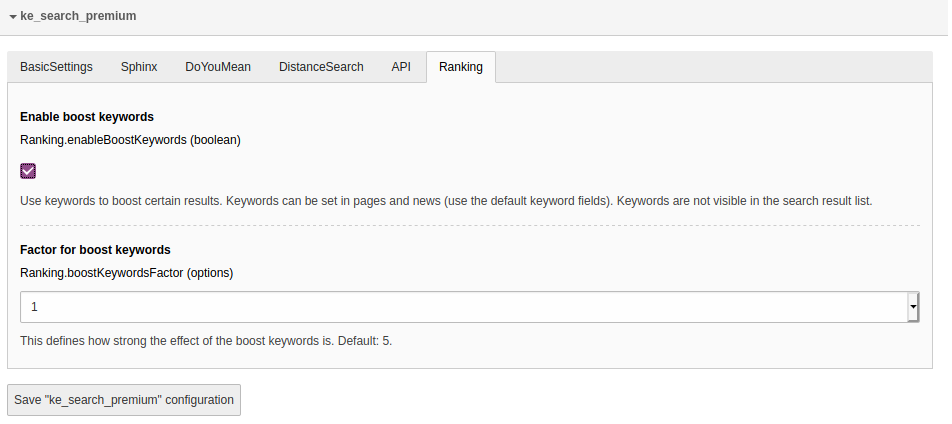
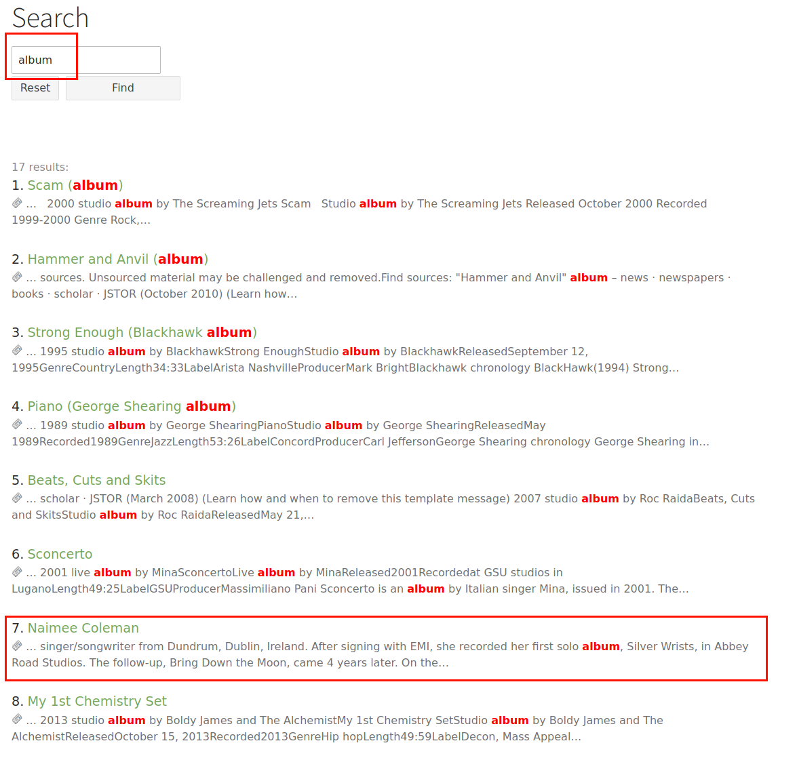
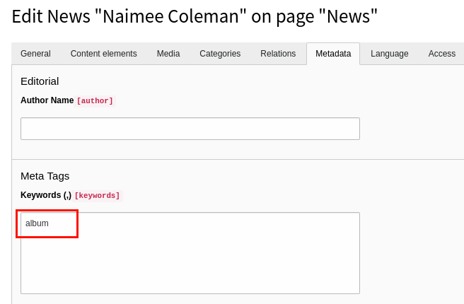
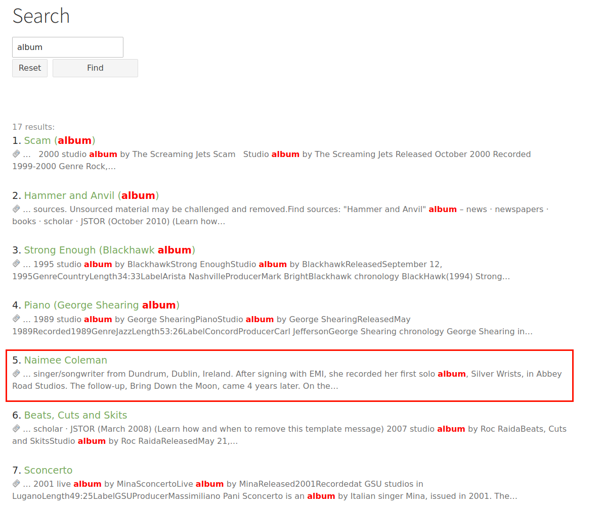
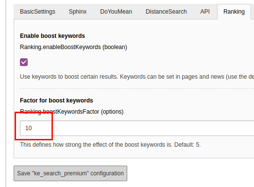
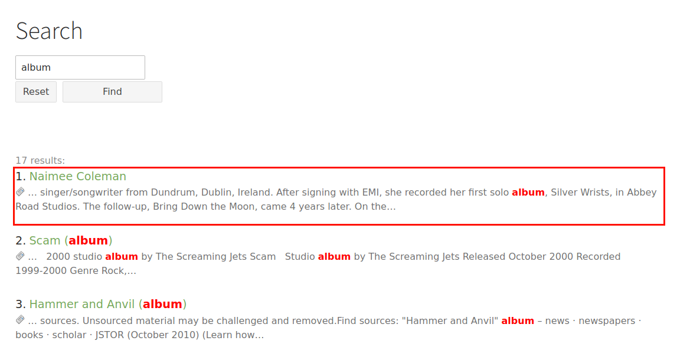

.. ==================================================
.. FOR YOUR INFORMATION
.. --------------------------------------------------
.. -*- coding: utf-8 -*- with BOM.

.. _BoostKeywords:

========================================
Boost Keywords
========================================

The "boost keywords" feature allows you to boost results to a higher position in the result list by assigning
keywords. If a search for this keyword is started, results containing this keyword will be ranked
higher in the result list.

Use case examples
=================
* A user searches for "Meier". There's a page about a person called "Meier" in the index, but there are
  also lots of other content containing the word "Meier" in the index. Since "Meier" is not in the title of the page
  (maybe the page is called "Our new CEO"), the page is not ranked very high for this search word. We want the result
  for the page about "Meier" to be at the top, therefore we add "Meier" as a boost keyword to the page record.
* A user searches for "campingchair". There's a product called "campingchar" and there are also
  news articles, and other content containing the word "campingchair". We want the
  product result to be at the top, therefore we add "campingchair" as a boost keyword to that record.

Notes
=====
* This feature does not work together with the "Sphinx"-feature.
* This feature works out-of-the box for pages and news (EXT:news). If you want to use for other types of data, you
  will have to add a hook or a custom indexer.
* This feature does currently (version 4.0.0) not work together with the distance search feature. This will be addressed
  in future versions.

Configuration
=============

You can enable/disable the boost keywords feature in the settings module in the extension configuration in the
tab "Ranking".

The setting "Factor for boost keywords" allows you to define how strong the keywords should be weighted which means
the higher you set this value, the stronger the "boost effect" will be.

Make sure set the sorting in the search plugin to "Relevance DOWN" in order to make the feature work!

Usage
=====
After activating the feature you can use the standard "keywords" field in pages and news records to add your
keywords (comma-separated). The boosting effect will only work for search words matching exactly the given keywords.
If in doubt which spelling or style the user will use, just add more keywords (eg "car,cars,vehicle,vehicles").

Example
=======
In this example we search for the word "album" in set of randomly imported articles from wikipedia.

One of the results is the article "Naimee Coleman". Without the boost keyword feature activated, this results ranks
as #7 for the search word "album". We want this result to rank higher.

We now give the new record the keyword "album".

After activating the boost keywords feature (see above: "Configuration") you will have to restart the indexer.

The result does now rank higher:

If the effect should be stronger, we can adjust the setting "Factor":

The result is now at the top of the list:

Adding your own keywords
========================

If you want to add your own keywords as boost keywords or if you want to add keywords to other content types than
pages or news, you will have to fill the column "boostkeywords" of the table "tx_kesearch_index" with your keywords.
You can use the hooks ke_search provides. Please have a look at the Boostingkeywords hook class at

::

  Classes/Hooks/BoostKeywords.php

