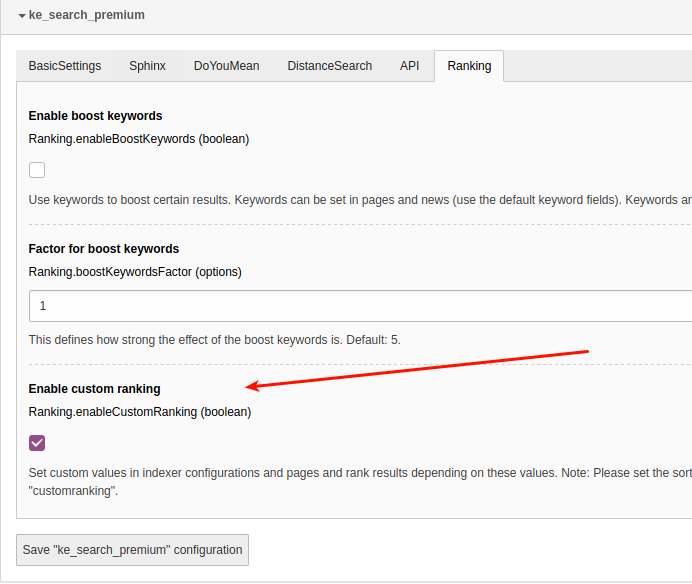
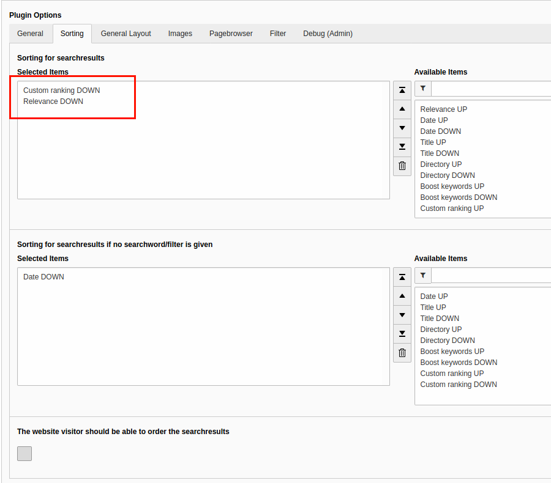
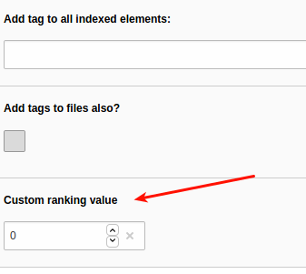
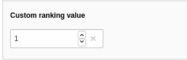
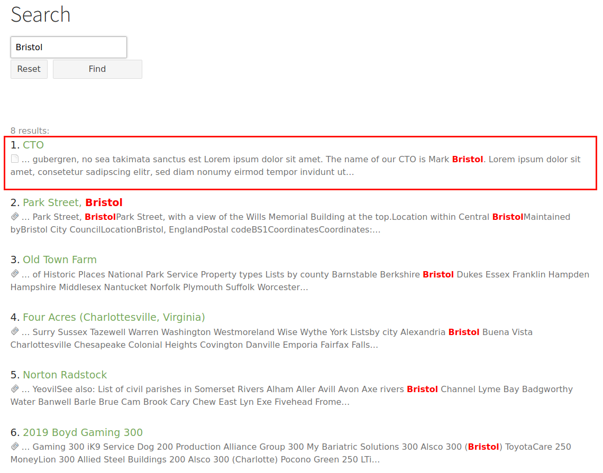

.. ==================================================
.. FOR YOUR INFORMATION
.. --------------------------------------------------
.. -*- coding: utf-8 -*- with BOM.

.. _CustomRanking:

========================================
Custom Ranking
========================================

The "custom ranking" feature allows you to give a numeric value to pages and indexer configurations. You
can then configure ke_search to sort the result list using this custom value. If both (pages and indexer
configuration) values are set, the will be summed up.

Use case examples
=================
* Show all page records before other records (eg. files or news).
* Show product pages on top.
* Show pages about persons on top.
* Show certain results at the end of the list.

Notes
=====
* This feature does not work together with the "Sphinx"-feature.
* This feature needs at least ke_search 3.1.5 because before that it was not possible to use multiple sortings.

Configuration
=============

You can enable/disable the custom ranking feature in the settings module in the extension configuration in the
tab "Ranking".

After that please set the sorting to "Custom ranking DOWN" and "Relevance DOWN" in the plugin options (needs at
least ke_search 3.1.5).

Usage
=====
You will find a field "Custom ranking value" in the page properties in the tab "Search" and in indexer configurations.

By setting this value, the page or the records fetched by this indexer configuration will be sorted to the very
top of the result list. If both values are set, they will be summed up. You can also set negative values to push
results to the end of the list.

Example
=======
In this example we have a page about the CTO of a company, "Mark Bristol". Search for "Bristol" shows also
some news containing the word "Bristol".

.. image:: ../Images/CustomRanking/customranking-5.png

We want to show the "CTO"-page on top of the list, thus we give it a custom ranking value of "1".

After re-indexing, the page is at the top of the list. Note that this page now will always be on top of the list,
whenever it appears in the search result list.
If you only want to give it a push when someone searches for "Bristol" you should use the :ref:`BoostKeywords`
feature.

Adding your own custom ranking values
=====================================

If you want to use custom ranking values for your own indexers, you will have to fill the column "customranking"
of the table "tx_kesearch_index" with the desired value.
You can use the hooks ke_search provides. Please have a look at the Custom ranking hook class at

::

  Classes/Hooks/CustomRanking.php

