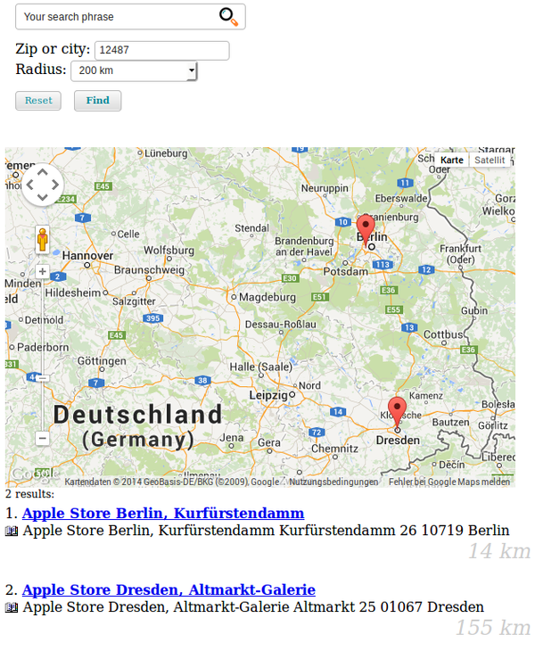

.. ==================================================
.. FOR YOUR INFORMATION
.. --------------------------------------------------
.. -*- coding: utf-8 -*- with BOM.

.. _DistanceSearch:

==================================================
Distance based search with Google Maps integration
==================================================

This feature gives you the possibility to search for hits in a
certain radius around a given zip or city. The hits may be
presented on a map (using Google Maps).

System requirements
===================
- "curl" has to be installed.
- Activate distance search (see chapter "How to activate the distance search")
- Since distance calculation is done within MySQL, it is not possible to use "Sphinx" at the same time.

*Note*:
  Since version 1.7.3 you can disable Sphinx on certain pages in order to use the distance
  search on these pages and Sphinx on other pages.

  Insert this into your page typoscript setup:

  ``ke_search_premium.extconf.override.enableSphinxSearch = 0``

*Note*:
  This feature does currently (version 4.0.0) not work together with the boost keywords feature. This will be addressed
  in future versions.

How to activate the distance search
===================================
- Install "tt_address" and create address records.
  By default the distance search is based on tt_address.
  It is possible to use other types of records (see below).
- Open the configuration menu of ke_search_premium in the extension manager and
  activate the distance search in the first tab.
- Geocoding is done using an interface provided by Google
  (https://developers.google.com/maps/documentation/geocoding/). You will need an API
  key for that. Provide your API Key in the extension configuration, tab "DistanceSearch".
- In the tab "distance search" fill out the country field. This is used for geocoding the zip or city in the search
  form and for the addresses if the do not have a country given.
- In order to display the distance and the map in the frontend, you can place
  markers in your own template or activate the options "display distance in
  standard-template" and "display map in standard-template" in the extension-manger.
- If you use your own template, you can use the markers ###DISTANCE### in the Subpart
  RESULT_ROW and ###MAP### in the Subpart RESULT_LIST.
- Create a filter record of type "Distance search". This filter type does not have filter
  options.
- Add this filter to the list of filters to be displayed in your plugin "Searchbox and filters".
- Add a indexer configuration of type "Addresses (tt_address)".
  Geocoding will be done upon the next indexing.

Configuration
=============
The distance search may be configurated using this typoscript:

::

	plugin.tx_kesearchpremium {
		distancesearch {
			templatepath = EXT:ke_search_premium/Resources/Private/Templates/
			radiusoptions = 10,20,50,100,200
			radiuslabel = km
		}
	}

Geocode own content
===================
In order to geocode your own content you will have to create a hook in your
own extension and do the geocoding.

Please have a look at the hook ``modifyAddressIndexEntry``
(ke_search_premium/Classes/Distancesearch.php) delivered with ke_search_premium.

Notes
=====
- When the distance search is used, the sorting will be changed to "Distance ascending".
  If sorting links were activated in the frontend, these will be hidden.
- Right now only tt_address records are geocoded automatically and can be used for the
  distance search. The geocoding is done with the fields address, zip, city and country.