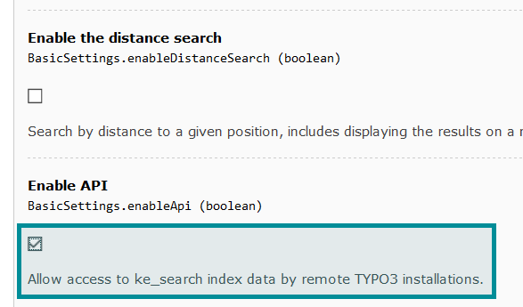
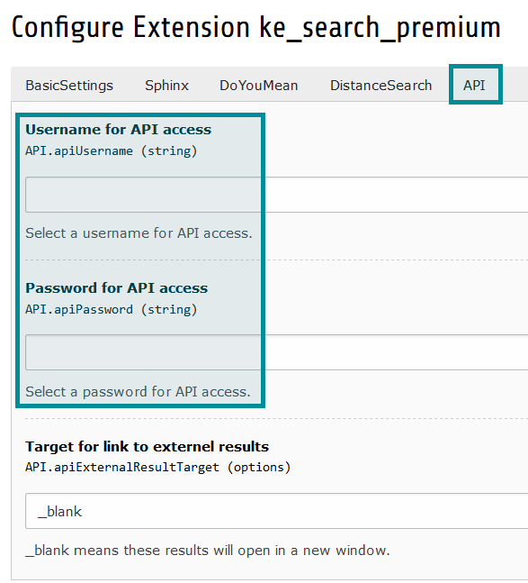
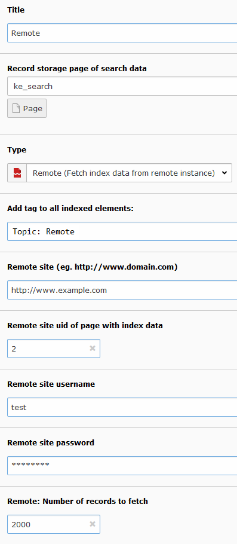

.. ==================================================
.. FOR YOUR INFORMATION
.. --------------------------------------------------
.. -*- coding: utf-8 -*- with BOM.

.. _RemoteIndexer:

========================================
Remote indexer
========================================

Using the remote indexer you can transfer search results from one TYPO3 instance to another.
In the main instance you can then search both, the main and the remote index using the same search form.

Configuration steps
===================

- Install ke_search_premium in the main and in the remote TYPO3 instance.
- Activate the "API" function in the extension manager.
- On the remote website: Set username and password in the "API" tab.
- On the main website: Add an indexer configuration. Set the domain,
  login data and page uid on which the search index is saved in the remote instance.
- Starting the indexer will now transfer the data from remote to the main instance where it can be searched.
- You can set a tag in order to use facetting for the transfered data.

*Note*
  Protected content (frontend user group) will not be transfered.

Activate API function
---------------------

Set login data
--------------

Add an indexer configuration
----------------------------

