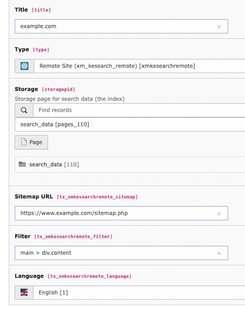

# TYPO3 extension `xm_kesearch_remote`

This extension adds a new indexer for [ke_search](https://extensions.typo3.org/extension/ke_search) that fetches and indexes remote websites. The remote website needs to offer a `sitemap.xml`.

## Installation

```
composer require xima/xm-kesearch-remote
```

## Configuration

Create a new indexer and select `xm_kesearch_remote`. Add the URL to the remote sitemap which contains the links to index.



The indexer will crawl all links in the sitemap and cache the fetched content as json files. In the extension configuration you can change the cache directory.

To reduce the amount of downloaded data, you can filter the DOM with a css-like filter in the `Filter` field.

You can select a specific language the indexed data will be assigned to.


## For developers

You can modify the mapping of `SitemapLink`s by creating a custom crawler.

To create a custom crawler for parsing the remote sitemap, you can implement the `CrawlerInterface` in your own extension and register the class via PageTS:

```
TCEFORM.tx_kesearch_indexerconfig.tx_xmkesearchremote_crawler.addItems.Vendor\YourExtension\Crawler\CustomCrawler = My custom crawler
```

Example `CustomCrawler.php`:

```
<?php

namespace Vendor\YourExtension\Crawler;

use Symfony\Component\DomCrawler\Crawler;
use Xima\XmKesearchRemote\Crawler\CrawlerInterface;
use Xima\XmKesearchRemote\Domain\Model\Dto\SitemapLink;

class CustomCrawler implements CrawlerInterface
{

    public function convertXmlToLinks(string $xml, array $config): array
    {
        if (!$xml) {
            return [];
        }

        $sitemapUrl = $config['tx_xmkesearchremote_sitemap'] ?? '';

        $crawler = new Crawler($xml);

        return $crawler->filter('site')->each(function (Crawler $parentCrawler) use ($sitemapUrl) {
            $link = new SitemapLink($sitemapUrl);
            $link->loc = (string)$parentCrawler->children('link')->getNode(0)?->nodeValue ?: '';
            $link->lastmod = (int)($parentCrawler->children('lastmod')->getNode(0)?->nodeValue ?: 0);
            return $link;
        });
    }
}
```
