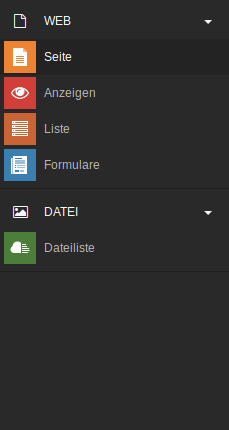
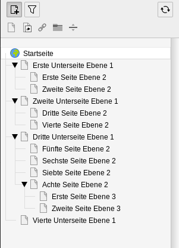
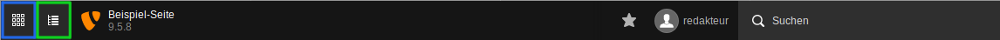

=== Login

[frame="none",border="none",stripe="none",grid="rows",cols=".<65,>35"]
|===
| Der Zugang zum TYPO3 Backend ist durch einen Login-Maske beschränkt. Diese erreichen Sie, wenn Sie zu der vollständigen Adresse der Webseite (z.B. www.beispiel-webseite.de) noch /typo3/ hinzufügen. Also:
*'www.beispiel-webseite.de/typo3/*.
Um sich anzumelden, müssen Sie Ihren Benutzernamen und Ihr Passwort eingeben. Unterhalb des Loginbereichs sind Systemnachrichten hinterlegt, in welchen zum Beipiel angezeigt wird, zu welchen Zeiten Wartungsarbeiten durchgeführt werden. | image:img/backend/login.png[width=200]
|===

=== Übersicht

image::img/backend/backend.png[]

* A = Modulleiste
* B = Navigationsleiste
* C = Arbeitsbereich
* D = Kopfleiste

=== Modulleiste
Der Zugriff auf die einzelnen Module ist abhängig von den Rechten, die der einzelne Redakteur besitzt. Administratoren haben Zugriff auf alle verfügbaren Module.

=== Überblick

[frame="none",border="none",stripe="none",grid="rows",cols="65,>35"]
|===
a|* Web
** Seite: Seiten und Seiteninhalte können angelegt und bearbeitet werden
** Liste: zeigt alle Datensätze der ausgewählten Seite an
* Datei
** Dateiliste: Dateien, Bilder und Videos können hier hochgeladen, verschoben oder gelöscht werden | 
|===

==== Seite

In diesem Modul können Sie die Seiten anlegen, bearbeiten und löschen. Im Arbeitsbereich können Sie außerdem Inhaltselemente auf den jeweiligen Seiten anlegen, bearbeiten und löschen. Eine genauere Beschreibung Ihrer Möglichkeiten finden Sie in den Kapiteln <<_seitentypen,Mit Seiten arbeiten>> und <<_symbole_im_inhaltsbereich,Mit Inhaltselementen arbeiten>>.

==== Anzeigen

Mithilfe dieses Moduls können Sie sich anzeigen lassen wie die einzelnen Seiten im Frontend für den Besucher der Webseite aussehen. Dabei können Sie zwischen verschiedenen Formaten und Größen wechseln, um beispielsweise zu prüfen, wie die Seite ausgegeben wird, wenn Sie in einem Smartphone oder Tablet aufgerufen wird.

==== Liste

In diesem Modul finden Sie Seiten, Inhaltselemente und Datensätze in Tabellenform dargestellt. Sie können hier ebenso wie im Modul *Seite* Seiten anlegen, berbeiten und löschen. Darüber hinaus ist dasselbe auch mit Inhaltselementen möglich. Im Gegensatz zum *Seiten* Modul können Sie je nach Ihren Benutzerrechten auch noch andere Datensätze anlegen. Dazu zählen beispielsweise Kategorie, News-Datensätze oder Datensätze für andere Erweiterungen. Meistens sind im Seitenbaum spezielle Ordner angelegt, die für genau eine Art dieser Datensätze bestimmt sind.

==== Dateiliste

Innerhalb diese Modul können Sie die notwendigen Dateien für Ihre Webseite verwalten. Da es bei vielen Dateien sehr schnell unübersichtlich wird, gibt es die Möglichkeit Ordner anzulegen. Somit kann eine übersichtliche Struktur angelegt werden, um Dateien und Bilder möglichst schnell zu finden. Eine genauere Beschreibung finden Sie im Kapitel <<_verwalten_von_ordnern,Mit Dateien und Bildern arbeiten>>.

==== Einstellung

Wenn Sie mit einem Mausklick auf Ihren Nutzername in der Kopfleiste klicken, öffnet sich eine Anzeige, in welcher Sie neben der Möglichkeit zum Abmelden aus Ihrem Account auch auf Ihre Benutzereinstellung zugreifen können. Je nach Benutzerrechten, können Sie hier beispielsweise Ihren Namen, E-Mail-Adresse oder Ihr Passwort ändern. Mit Klick auf image:img/icons/actions/actions-document-save.svg[scaledwidth="12"] *Speichern* werden Ihre Änderungen übernommen.

=== Navigationsleiste

In diesem Bereich wird die jeweilige Navigation des ausgewählten Moduls angezeigt.
Im Modul Seite wird beispielsweise der Seitenbaum der Webseite angezeigt. Je nach Rechten des Redakteurs können hier auch nur einzelnen Seitenbäume oder Seiten der Webseite angezeigt werden.

==== Der Seitenbaum

[frame="none",border="none",stripe="none",grid="rows",cols="70,>30"]
|===
| Den Seitenbaum kann man sich wie einen Baum mit Ästen, die wiederum Äste haben können, welche wiederum Äste haben können, usw. vorstellen. An oberster Stelle steht die Hauptseite, von welcher alle anderen Seiten ausgehen. Jede Seite kann dabei mehrere Unterseiten besitzen, welche wiederum Unterseiten besitzen können. a| 
|===

=== Arbeitsbereich

In diesem Bereich werden je nach ausgewähltem Modul unterschiedliche Dinge angezeigt. Im Modul Seite sieht man beispielweise die Inhaltselemente auf der jeweiligen Seite, während man im Modul Dateiliste den Inhalt des ausgewählten Ordners sieht.

=== Kopfleiste

Die Kopfleiste stellt verschiedene Funktionen und Informationen bereit. Mit dem zur Verdeutlichung blau markierten Bereich können Sie die Modulansicht auf- und zuklappen. Im zugeklappten Zustand sind nur die Symbole der jeweiligen Module zu sehen. Mit Klick auf den hier grün markierten Bereich kann der Seitenbaum verborgen bzw. angezeigt werden. Im Modul Dateiliste kann damit analog der Verzeichnisbaum verborgen bzw. angezeigt werden.

Im Bereich mit dem TYPO3 Logo wird der Name der Webseite und die verwendete TYPO3 Version angezeigt (im Beispielbild Version 9.5.8).
Hinweis: In Ihrer TYPO3 Installation kann ein anderes Logo statt des TYPO3-Logos angezeigt sein (beispielsweise das Logo Ihrer Organisation).

Mit Klick auf image:img/icons/actions/actions-system-shortcut-new.svg[scaledwidth="12"] werden Ihnen die Ansichten angezeigt, welche Sie als Lesezeichen markiert haben. Rechts neben image:img/icons/actions/actions-system-shortcut-new.svg[scaledwidth="12"] wird Ihnen Ihr Benutzername und Ihr Nutzerbild angezeigt. Je nach Ihren Benutzerrechten können Sie hier mit Klick auf Ihren Namen die Benutzereinstellung öffnen (siehe <<_einstellung>>).
Ganz rechts in der Kopfleiste befindet sich noch die Suche, mit welcher Sie im gesamten System nach Seiten, Inhaltselementen, Dateien oder Datensätzen suchen können.

