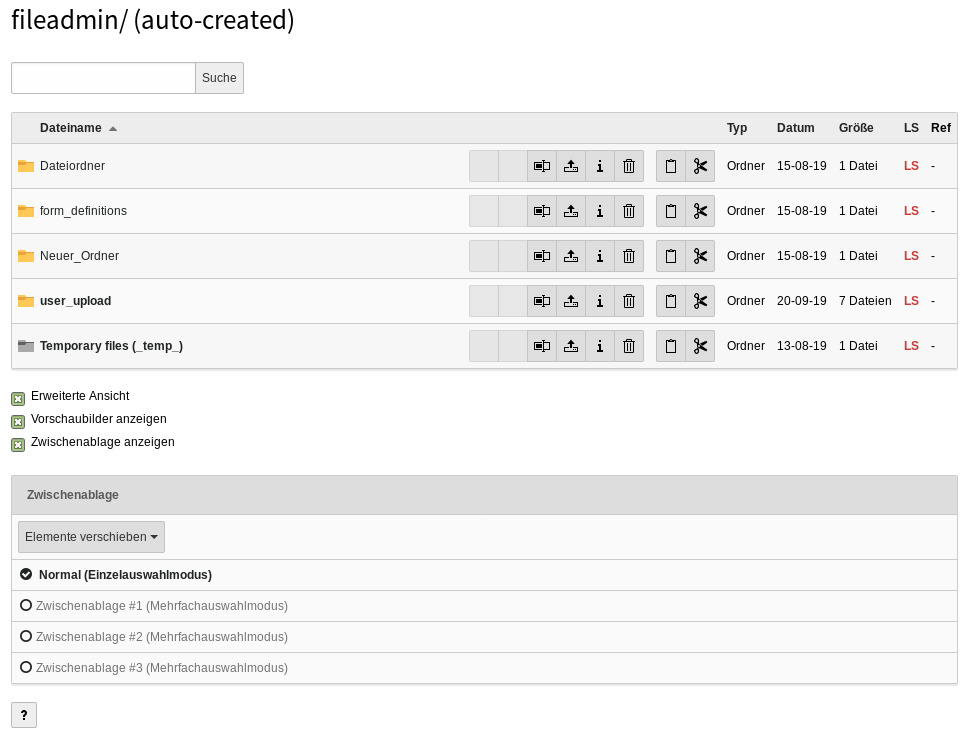
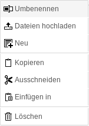
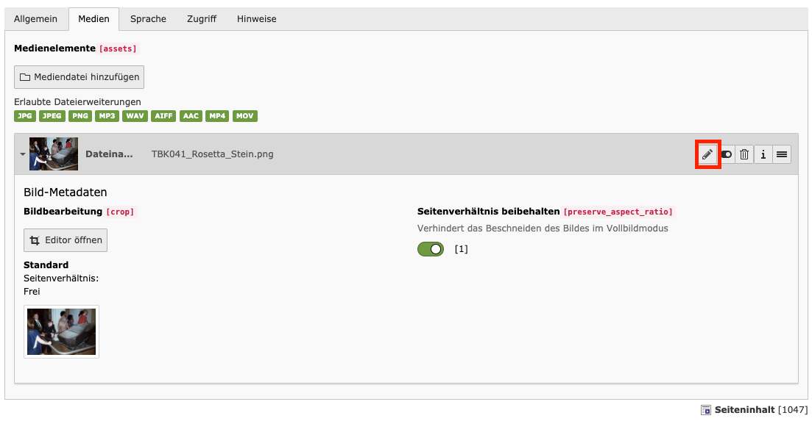

TYPO3 bietet die Möglichkeit, verschiedene Dateien in einer zentralen Dateiverwaltung abzuspeichern. Die Zugriffsrechte für Redakteure können dabei individuell angepasst werden. Somit können beispielsweise die einzelnen Redakteure nur Zugriff auf bestimmte Dateiordner haben.

Die Dateiverwaltung erreicht man in der Modulleiste unter *Datei* -> *Dateiliste*.

Grundsätzlich ist es am geschicktesten, Ihre Dateien in verschiedenen Ordner abzuspeichern. So ist es einfacher, diese bei Bedarf schnell wiederzufinden.

.Arbeitsbereich innerhalb des Moduls *Dateiliste* mit Aktivierung von *Erweiterte Ansicht* und *Zwischenablage anzeigen*

=== Verwalten von Ordnern

==== Ordner anlegen

Es gibt verschiedene Möglichkeiten, einen Ordner anzulegen. Nachfolgend werden alle beschrieben, jedoch reicht es vollkommen aus, eine Methode zu kennen und anzuwenden.

* Wechseln Sie in das Modul *Datei* -> *Dateiliste*.
* Klicken Sie im Ordnerbaum auf den Ordner, in welchen Sie einen Unterordner anlegen möchte.
* Im Bearbeitungsfeld sind nun alle Unterordner und Dateien, welche in jenem Ordner gespeichert sind zu sehen.
* Mit Klick auf  in der oberen Leiste können Sie nun einen oder mehrere Unterordner anlegen.
* In dem Auswahlfeld *Anzahl der Ordner* können Sie festlegen, wie viele neue Unterordner Sie anlegen möchten.
* Nun muss nur noch ein Name für jeden neuen Ordner vergeben werden.
* Abschließend wird der beziehungsweise werden die Ordner mit Klick auf *Ordner anlegen* erstellt.

WARNING: Achten Sie darauf, dass die Bezeichnungen der Ordner *keine* Umlaute, Leer- oder Sonderzeichen enthalten.

==== Ordner unbennen

*Erste Methode*

[frame="none",border="none",stripe="none",grid="rows",cols="75,>25"]
|===
a|* Klicken Sie mit einem Rechtsklick auf den Ordner, den Sie umbenennen möchten.
* Wählen Sie im nun geöffneten Auswahlmenü die Option image:img/icons/actions/actions-rename.svg[scaledwidth="12"] *Umbenennen* aus.
* Geben Sie den gewünschten Namen im Bearbeitungsfeld ein.
* Klicken Sie abschließend auf image:img/icons/actions/actions-document-save-close.svg[scaledwidth="12"] *Speichern und Schließen*. | 
|===

*Zweite Methode*

* Aktivieren Sie zunächst die **Erweiterte Ansicht** durch Setzen eines Häkchens unterhalb der Dateienliste.
* Klicken Sie im Ordnerbaum auf den Ordner, der dem umzubenennenden Ordner übergeordnet ist.
* Im Bearbeitungsfeld ist nun der Ordner, den Sie umbenennen möchten aufgelistet.
* Klicken Sie auf image:img/icons/actions/actions-rename.svg[scaledwidth="12"] *Umbenennen*.
* Geben Sie den gewünschten Namen im Bearbeitungsfeld ein.

==== Ordner löschen

*Erste Methode*

* Klicken Sie mit einem Rechtsklick auf den Ordner, den Sie löschen möchten.
* Wählen Sie im nun geöffneten Auswahlmenü die Option image:img/icons/actions/actions-edit-delete.svg[scaledwidth="12"] *Löschen* aus.
* Um die Löschaktion abzuschließen, bestätigen Sie die Sicherheitsrückfrage mit Klick auf *Löschen*.

*Zweite Methoden*

* Aktivieren Sie die *Erweiterte Ansicht* durch Setzen eines Häkchens unterhalb der Dateienliste.
* Klicken Sie im Ordnerbaum auf den Ordner, der dem zu löschenden Ordner übergeordnet ist.
* Im Bearbeitungsfeld ist nun der Ordner, den Sie löschen möchten aufgelistet.
* Klicken Sie auf image:img/icons/actions/actions-edit-delete.svg[scaledwidth="12"].
* Um die Löschaktion abzuschließen, bestätigen Sie die Sicherheitsrückfrage mit Klick auf *Löschen*.

=== Verwalten von Dateien

Prinzipiell kann die Dateiverwaltung mit vielen verschiedenen Dateiformaten wie PDFs, Bildern und Videos umgehen. Um diese Dateien in das Dateimodul zu übertragen, müssen sie von Ihrem Computer hochgeladen werden.

==== Dateien hochladen

* Wechseln Sie in das Modul *Datei* -> *Dateiliste*.
* Klicken Sie im Ordnerbaum auf den Ordner, in welchen Sie eine Datei hochladen möchten.
* Klicken Sie in der Bearbeitungszeile auf image:img/icons/actions/actions-edit-upload.svg[scaledwidth="12"].
* Nun können Sie eine Datei von Ihrer Festplatte auswählen ( wenn sie die *Strg-Taste* gedrückt halten, können Sie mehrere Dateien auswählen und hochladen ).

CAUTION: Die Menge an Daten aller Dateien, die Sie in einem Schritt hochladen können, ist auf eine bestimmte Größe beschränkt.

==== Dateieigenschaften bearbeiten

* Wechseln Sie in das Modul *Datei* -> *Dateiliste*.
* Wählen Sie den Ordner aus, in welchem sich die Datei befindet, deren Eigenschaften Sie bearbeiten möchten.
* Klicken Sie in der Bearbeitungszeile auf den *Dateititel* oder auf image:img/icons/actions/actions-open.svg[scaledwidth="12"].
* Im nun geöffneten Bearbeitungsformular können Sie die Felder *Titel*, *Beschreibung* und *Alternativer Text* bearbeiten.
* Im Reiter *Kategorien* können Sie der Datei eine Kategorie zuordnen.
* Um die Bearbeitung abzuschließen, klicken Sie auf image:img/icons/actions/actions-document-save.svg[scaledwidth="12"] *Speichern* und  danach auf image:img/icons/actions/actions-message-ok-close.svg[scaledwidth="12"] *Schließen*.

WARNING: Bitte achten Sie darauf, dass die Dateinamen *keine* Umlaute, Sonderzeichen oder Leerzeichen enthalten, da dies zu Problemen führen kann!

==== Dateien löschen

* Wechseln Sie in das Modul *Datei* -> *Dateiliste*.
* Aktivieren Sie die *Erweiterte Ansicht* durch Setzen eines Häkchens unterhalb der Dateienliste.
* Wählen Sie den Ordner aus, in welchem sich die Datei befindet, die Sie löschen möchten.
* Klicken Sie in der Bearbeitungszeile auf image:img/icons/actions/actions-edit-delete.svg[scaledwidth="12"].
* Um die Löschaktion abzuschließen, bestätigen Sie die Sicherheitsrückfrage mit Klick auf *Löschen*.

==== Dateien verschieben

* Wechseln Sie in das Modul *Datei* -> *Dateiliste*.
* Aktivieren Sie die Zwischenablage *Zwischenablage anzeigen* durch Setzen eines Häkchens unterhalb der Dateienliste.
* Nun werden Ihnen im Bearbeitungsfeld die Optionen *Kopieren* durch image:img/icons/actions/actions-edit-copy.svg[scaledwidth="12"] und *Ausschneiden* durch image:img/icons/actions/actions-edit-cut.svg[scaledwidth="12"] angezeigt.
* Klicken Sie auf image:img/icons/actions/actions-edit-cut.svg[scaledwidth="12"].
* Nun befindet sich die Datei in der Zwischenablage.
* Wählen Sie nun den Ordner aus, in welchen Sie die Datei einfügen möchten.
* Klicken Sie hier entweder image:img/icons/actions/actions-edit-copy.svg[scaledwidth="12"] im Bearbeitungsfeld oder oben in der Bearbeitungsleiste, um die Datei einzufügen.
* Nun erscheint die Datei im neuen Ordner und befindet sich somit nicht mehr im alten Ordner.

==== Dateien kopieren

* Wechseln Sie in das Modul *Datei* -> *Dateiliste*.
* Aktiviere Sie die Zwischenablage *Zwischenablage anzeigen* durch Setzen eines Häkchens unterhalb der Dateienliste.
* Nun werden Ihnen im Bearbeitungsfeld die Optionen *Kopieren* durch image:img/icons/actions/actions-edit-copy.svg[scaledwidth="12"] und *Auschneiden* durch image:img/icons/actions/actions-edit-cut.svg[scaledwidth="12"] angezeigt.
* Klicken Sie auf image:img/icons/actions/actions-edit-copy.svg[scaledwidth="12"].
* Nun befindet sich die Datei in der Zwischenablage.
* Wählen Sie nun den Ordner aus, in welchen Sie die Kopie einfügen möchten.
* Klicken Sie hier entweder image:img/icons/actions/actions-document-paste-into.svg[scaledwidth="12"] im Bearbeitungsfeld oder oben in der Bearbeitungsleiste, um die Datei einzufügen.

=== Datei-Metadaten

Die Metadaten von Dateien - z.B. Titel, Beschreibung und Copyright bei Bildern - werden für die einzelnen Dateien zentral hinterlegt.

Die Daten können über das Modul Dateiliste oder aus den einzelnen Referenzierungen heraus bearbeitet werden.

==== Modul Dateiliste

Klicken Sie im Modul *Datei > Dateiliste* entweder auf den Titel der Datei oder auf image:img/icons/actions/actions-open.svg[Edit,16,opts=inline].

Füllen Sie die entsprechenden Felder aus und klicken Sie oben auf _Speichern_.

==== Dateireferenzen

Klicken Sie in der Kopfleiste einer Dateireferenz auf den Bearbeiten-Stift image:img/icons/actions/actions-open.svg[Edit,16,opts=inline].

Es öffnet sich das Formular zur Bearbeitung der Metadaten der Originaldatei. Bearbeiten Sie die Daten in den entsprechenden Feldern und klicken Sie oben auf _Speichern_.

Die so hinterlegten Metadaten werden nun für alle Referenzen auf diese Datei verwendet - es sei denn, diese werden nochmals an der Dateireferenz direkt überschrieben. Dies ist je nach Konfiguration Ihrer TYPO3-Instanz möglich.
