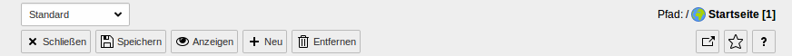
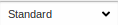
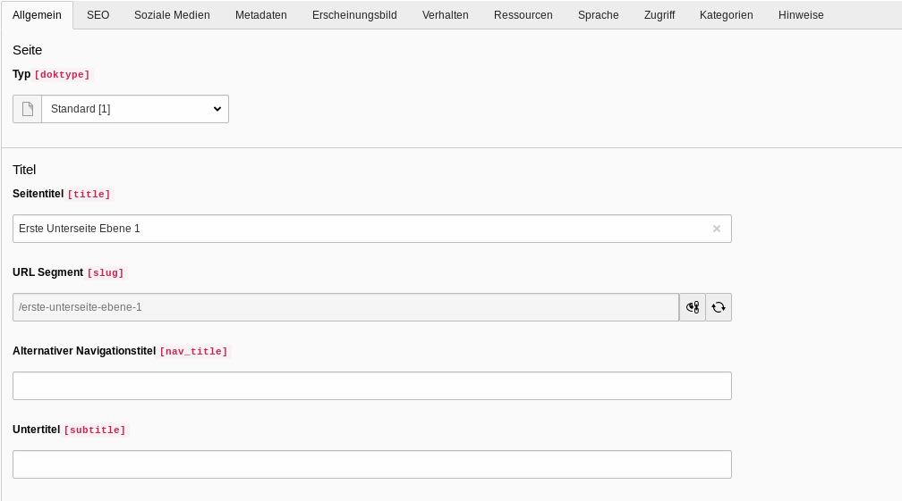
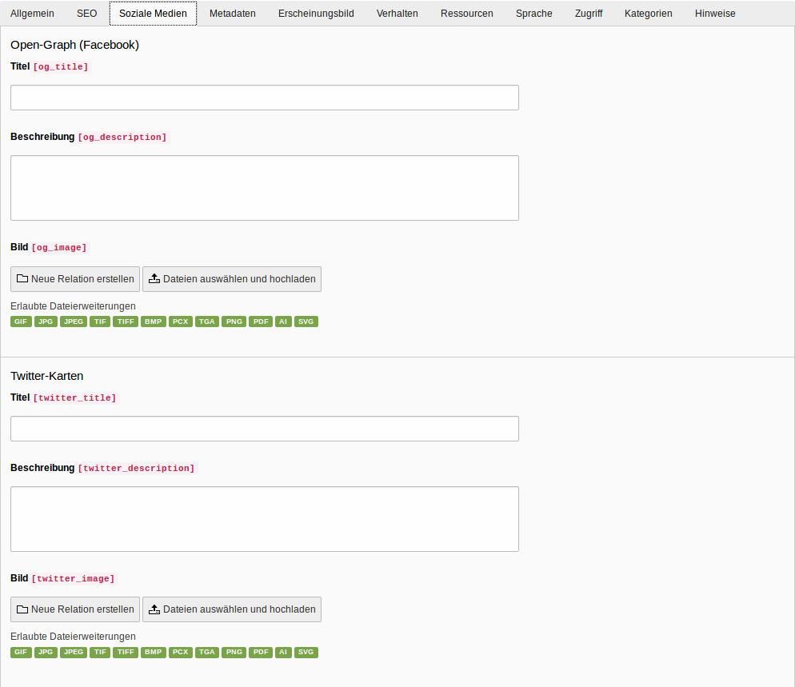
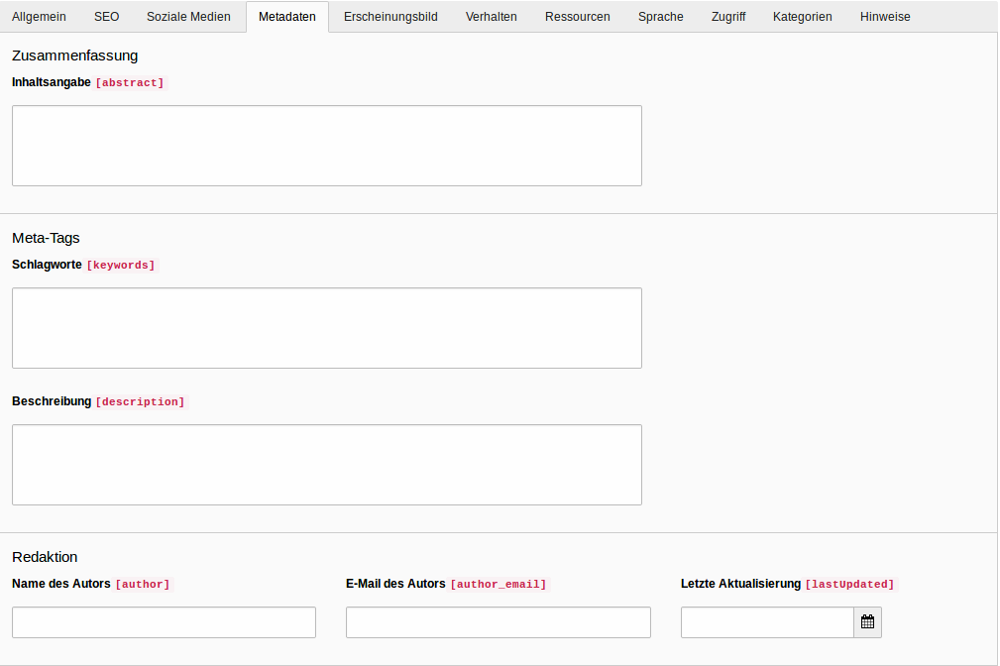
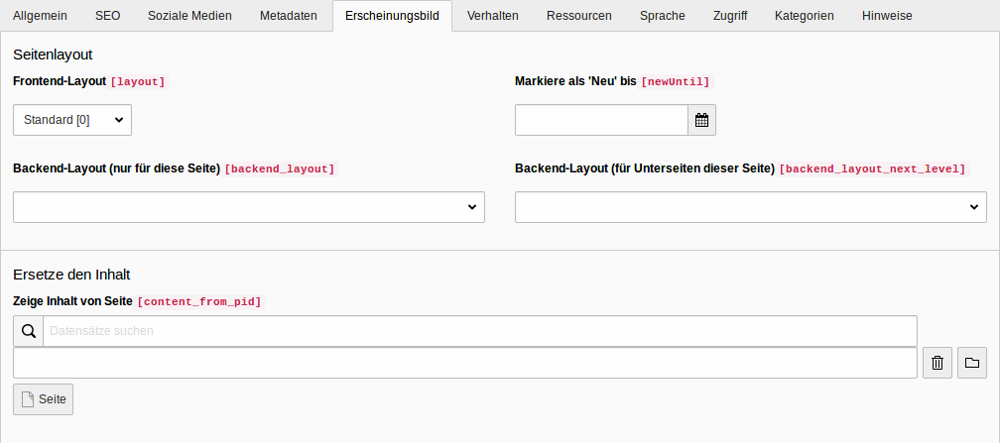
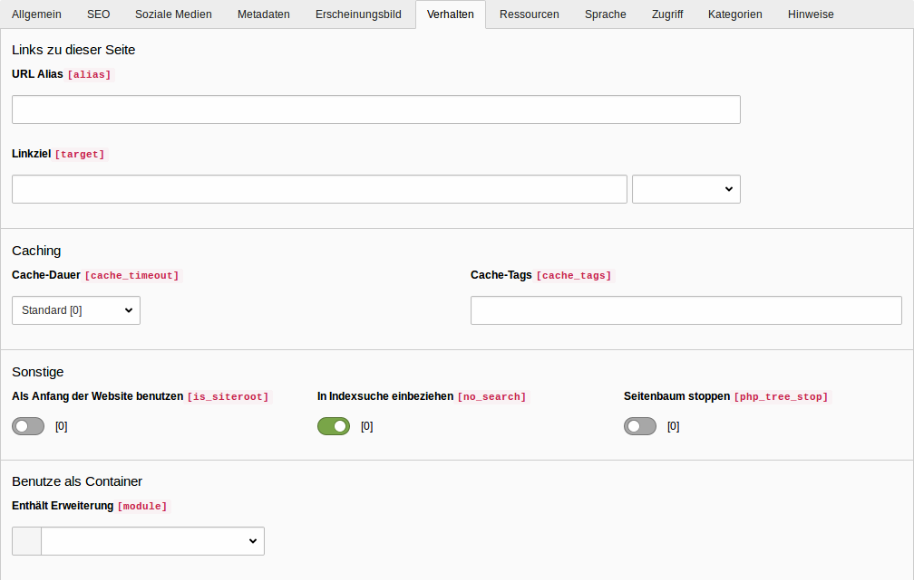
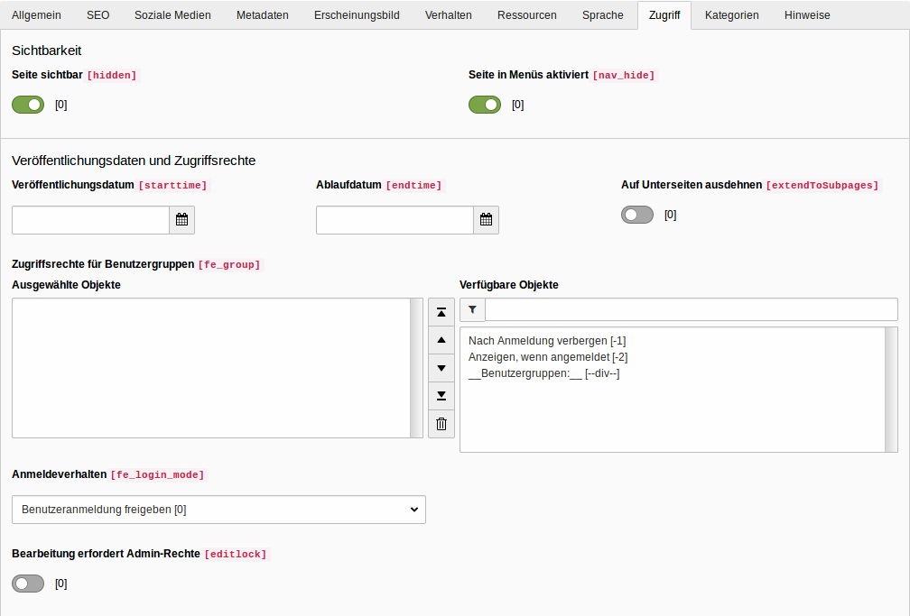
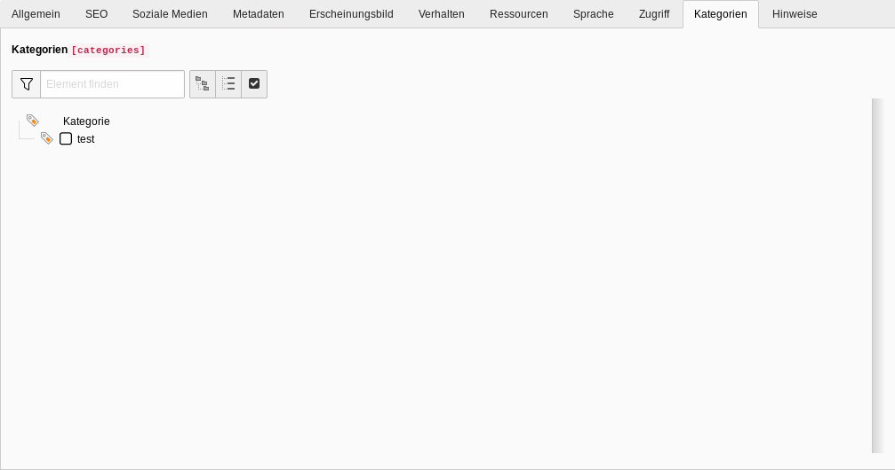
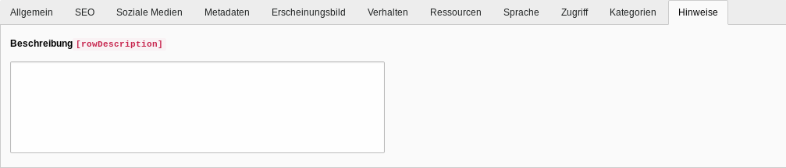

=== Seitentypen

Je nach Ihren Benutzerrechten werden Ihnen verschiedene Seitentypen angezeigt. Grundsätzlich ist für die meisten Redakteure nur die *Standard Seite* relevant.

* image:img/icons/types/apps-pagetree-page-domain.svg[scaledwidth="12"] *Wurzel-Seite*: Normale Standard Seite, welche den Anfang eines Seitenbaums darstellt.
* image:img/icons/types/apps-pagetree-page-default.svg[scaledwidth="12"] *Standard:*
Stellt die normale Standard Seite dar.
* image:img/icons/types/apps-pagetree-page-backend-users.svg[scaledwidth="12"] **Backend-Benutzerbereich:**
Wird für Seiten benutzt, die nur im Backend angesehen werden können.
* image:img/icons/types/apps-pagetree-page-shortcut.svg[scaledwidth="12"] *Verweis:*
Beinhalten einen Link/Verweis auf eine andere, interne Seite.
* image:img/icons/types/apps-pagetree-page-mountpoint.svg[scaledwidth="12"] *Einstiegspunkt:*
Verweist ebenso wie der _Verweis_ auf eine andere Seite.
*  **Link zu externer URL:**
Wird benutzt, um einen Verweis/Link auf eine externe Seite hinzuzufügen.
* image:img/icons/types/apps-pagetree-folder-default.svg[scaledwidth="12"] *Ordner:*
Wird benutzt, um Datensätze abzulegen (z.B. Artikel Datensätze).
*  *Papierkorb:*
Kann als Ablagestelle für Datensätze und für Seiten, die nicht mehr genutzt werden, aber noch nicht gelöscht werden sollen gebraucht werden.
*  *Trennzeichen für Menü:*
Wird häufig zur optischen Strukturierung des Seitenbaums genutzt. Ansonsten kann es genutzt werden, um ein Trennzeichen in einem Seitenmenü zu repräsentieren.

=== Symbole im Seitenbaum Arbeitsbereich

* image:img/icons/actions/actions-file-add.svg[scaledwidth="12"]: Blendet alle möglichen Seitentypen ein.
* :
Öffnet ein Suchfeld, in welchem der Seitenbaum mithilfe eines Suchbegriff gefiltert werden kann.
* image:img/icons/actions/actions-refresh.svg[scaledwidth="12"]:
Aktualisiert den Seitenbaum.

=== Seitenkontextmenü

* image:img/icons/actions/actions-view-page.svg[scaledwidth="12"] *Ansehen*: Zeigt eine Seite im Frontend an.
* image:img/icons/actions/actions-version-page-open.svg[scaledwidth="12"] *Bearbeiten*: Öffnet das Seitenformular zur Bearbeitung einer Seite.
* image:img/icons/actions/actions-file-add.svg[scaledwidth="12"] *Neu*:Neue Seite anlegen.
* image:img/icons/actions/actions-document-info.svg[scaledwidth="12"] *Info*: Zeigt Informationen über eine Seite an.
* image:img/icons/actions/actions-edit-copy.svg[scaledwidth="12"] *Kopieren*: ermöglicht die Kopie einer Seite, danach kann die Seite wiederum durch Rechtsklick auf eine bestimmte Seite entweder auf gleicher Ebene oder aber als Unterseite dieser angelegt werden.
*  *Auschneiden*: Schneidet eine Seite aus. Diese kann wiederum durch einen Rechtsklick an der gewünschten Stelle eingefügt werden.
* Weitere Optionen: Zeigt weitere Optionen an
* image:img/icons/actions/actions-edit-hide.svg[scaledwidth="12"] *Deaktivieren*: Deaktiviert eine Seite, sodass diese im Frontend nicht mehr sichtbar ist.
* image:img/icons/actions/actions-edit-delete.svg[scaledwidth="12"] *Löschen*: Löscht eine Seite aus dem Seitenbaum.
* image:img/icons/actions/actions-document-history-open.svg[scaledwidth="12"] *Verlauf/Rückgängig*: Öffnet das Formular, dass den Bearbeitungsverlauf einer Seite zeigt und ermöglicht es, einen oder mehrere Bearbeitungsvorgänge rückgängig zu machen.
* image:img/icons/actions/actions-system-cache-clear.svg[scaledwidth="12"] *Cache dieser Seite löschen*: Löscht den Cache für die ausgewählte Seite.

=== Seiten anlegen

Es gibt verschiedene Möglichkeiten, eine Seite zu erstellen. Im Folgenden werden die gebräuchlichsten beschrieben. Grundsätzlich spielt es keine Rolle, welche Methode Sie verwenden. Daher können Sie die Methode, die Ihnen am intuitivsten erscheint, verwenden.

==== Im Modul Seite

* Klicken Sie auf image:img/icons/actions/actions-file-add.svg[scaledwidth="12"] oberhalb des Seitenbaums. Klicken Sie auf image:img/icons/types/apps-pagetree-page-default.svg[scaledwidth="12"] und halten Sie die Maus gedrückt. Nun kann image:img/icons/types/apps-pagetree-page-default.svg[scaledwidth="12"] an die gewünschte Stelle verschoben werden und eingefügt werden.

* Klicken Sie mit einem Rechtsklick auf eine Seite und wählen Sie die Zeile mit image:img/icons/actions/actions-file-add.svg[scaledwidth="12"] und der Beschriftung *Neu* aus. Nachdem Sie einen Namen vergeben haben und **Speichern** geklickt haben, wird die Seite wird nach und auf derselben Ebene der Seite, auf die Sie den Rechtsklick ausgeführt haben, abgepeichert.

* Wenn Sie die Bearbeitungsmaske eines Inhaltselement geöffnet haben können Sie in den oberen Leiste mit Klick auf image:img/icons/actions/actions-file-add.svg[scaledwidth="12"] eine neue Seite erstellen. Die Seite wird nach und auf derselben Ebene der Seite, deren Bearbeitungsformular gerade geöffnet ist, angelegt.

* Nach dem gleichen Muster lässt sich mit Rechtsklick auf image:img/icons/types/apps-pagetree-page-default.svg[scaledwidth="12"] in der Pfadanzeige oder mit Rechtsklick auf image:img/icons/types/apps-pagetree-page-default.svg[scaledwidth="12"]unterhalb des Bearbeitungsformular eine neue Seite anlegen.

TIP: Funktioniert mit derselben Vorgehensweise auch aus dem *Liste* Modul heraus

==== Im Modul Liste

* Klicken Sie in der Tabelle mit den Seiten auf image:img/icons/actions/actions-file-add.svg[scaledwidth="12"]. Nun können Sie mit einem Klick auf den Pfeil die Position, an welcher die neue Seite angelegt werden soll, bestimmen.

* Klicken Sie in der Übersicht des Menüs auf image:img/icons/actions/actions-file-add.svg[scaledwidth="12"]. Hier können Sie zwischen image:img/icons/types/apps-pagetree-page-default.svg[scaledwidth="12"] **Seite (in)**, welches eine Seite unterhalb der ausgewählten Seite erstellt,image:img/icons/types/apps-pagetree-page-default.svg[scaledwidth="12"] **Seite(nach)**, welches eine Seite nach der ausgewählten Seite erstellt und image:img/icons/types/apps-pagetree-page-default.svg[scaledwidth="12"] **Seite (Position auswählen)**, bei welcher die Position der Seite im Seitenbaum manuell ausgewählt werden kann, wählen.

==== Mehrere Seiten erstellen

* Klicken Sie per Rechtsklick auf eine Seite im Seitenbaum, unterhalb derer Sie mehrere Seiten anlegen wollen. Wählen Sie im Menü **Weitere Optionen...**  aus. Wählen Sie dann image:img/icons/symbols/apps-pagetree-drag-move-between.svg[scaledwidth="12"] **Mehrere Seiten erzeugen** aus.

=== Seiten verbergen und freigeben

Neu angelegte Inhaltsseiten werden standardmäßig verborgen. Um die Seite im Frontend freizugeben, wählen Sie diese aus und klicken Sie mit der rechten Maustaste auf image:img/icons/types/apps-pagetree-page-default.svg[scaledwidth="12"]. Wählen Sie dann *Aktivieren* im Kontextmenü.
Um eine Seite zu verbergen, klicken Sie mit der rechten Maustaste auf image:img/icons/types/apps-pagetree-page-default.svg[scaledwidth="12"]. Wählen Sie dann *Deaktivieren* im Kontextmenü.

=== Seiten im Seitenbaum verschieben

Um die Reihenfolge der Seiten im Seitenbaum zu ändern, können Sie die einzelnen Seiten einfach per Drag & Drop verschieben. Klicken Sie mit der **linken Maustaste** auf die zu verschiebende Seite und ziehen Sie diese bei gedrückt gehaltener Maustaste zu der Seite, in oder unterhalb welcher die ausgewählte Seite eingefügt werden soll.

Wollen Sie die Seite auf der gleichen Seitenebene einfügen, warten Sie bis eine Linie erscheint. Die Seite wird hinter oder vor der Seite eingefügt, auf welcher Sie die Maustaste loslassen.

Wollen Sie die Seite eine Seitenebene tiefer verschieben, warten Sie bis ein blauer Hintergrund erscheint. Die Seite wird dann unterhalb der Seite, auf welcher Sie die Maustaste losgelassen haben, eingefügt.

=== Seitenvorschau

Um sich die Seite im Frontend anzusehen, wählen Sie diese aus und klicken mit rechten Maustaste auf image:img/icons/types/apps-pagetree-page-default.svg[scaledwidth="12"]. Im Kontextmenü wählen Sie dann *Ansehen*.

=== Seite löschen

Um eine Seite zu löschen, wählen Sie diese im Seitenbaum aus und klicken Sie mit der rechten Maustaste auf diese. Wählen Sie im Kontextmenü **Löschen** aus und bestätigen Sie die Rückfrage anschließend mit **Ja**.

=== Symbole für das Bearbeitungsformular

* : Wenn die Webseite mehrere Sprachvariante anbietet, kann hier ausgewählt werden, in welche Sprache das Inhaltselement bearbeitet werden soll.
* image:img/icons/actions/actions-message-ok-close.svg[scaledwidth="12"] **Schließen**: Schließt das Seitenformular.
* image:img/icons/actions/actions-document-save.svg[scaledwidth="12"] **Speichern** : Speichert die aktuelle Seitenformular Version ab.
* image:img/icons/actions/actions-version-workspace-preview.svg[scaledwidth="12"] **Anzeigen**: Öffnet die ausgewählte Seite in einem neuem Fenster im Frontend.
* image:img/icons/actions/actions-add.svg[scaledwidth="12"] **Neu**: Ermöglicht das Anlegen einer neuen Seite ( siehe Anlegen einer neuen Seite ).
* image:img/icons/actions/actions-edit-delete.svg[scaledwidth="12"] **Entfernen**: Löscht die aktuelle Seite.
* : Öffnet das Bearbeitungsformular in einem neuen Fenster.
* : Erzeugt ein Lesezeichen auf das geöffnete Formular.
* : Zeigt einen kurzen Hilfetext zur Bedeutung des jeweiligen Formulars an.

=== Das Seitenformular

Im Seitenformular können Sie verschiedene Einstellungen vornehmen. Das Seitenformular ist in mehrere Tabs unterteilt. Welche Tabs Sie sehen und bearbeiten können, hängt von Ihren Benutzerrechten ab.
Bei vollen Zugriffsrechten werden folgende Tabs angezeigt:

* Allgemein
* SEO
* Soziale Medien
* Metadaten
* Erscheinungsbild
* Verhalten
* Ressourcen
* Sprache
* Zugriff
* Kategorien
* Hinweise

==== Tab "Allgemein"

===== Abschnitt "Seite"

* _Typ_: Auswahlfeld, um den Seitentyp festzulegen.

===== Abschnitt "Titel"

* _Seitentitel_: Textfeld, um den Seitentitel zu bestimmen.
* _URL Segment_: Textfeld, in welchem der Pfad zur Seite angezeigt wird.
* _Alternativer Navigationstitel_: Textfeld, um einen alternativen Text, welcher im Seitenmenü statt des Seitentitels angezeigt wird, anzugeben.
* _Untertitel_: Textfeld, um einen Untertitel einzutragen.

==== Tab "SEO"

image:img/site/properties/seo.png[]

===== Abschnitt "Allgemeine SEO-Einstellungen"

* _Titel für Suchmaschinen_: Textfeld, um einen Titel, der für Suchmaschinen angezeigt werden soll, anzugeben.

===== Abschnitt "Robot-Anweisungen"

* _Index dieser Seite_: Checkbox, um festzulegen, ob die Seite von Suchmaschinen indexiert werden soll.
* _Dieser Seite folgen_: Checkbox, um festzulegen, ob Suchmaschinen der Seiten folgen sollen oder nicht.
* _Kanonischer Link_: Linkfeld, in welchem eine Seite als sogenannter Kanonischer Link ausgewählt werden kann. Kanonische Links werden bei Seiten, welche denselben Inhalt haben, benutzt, um die Arbeit von Suchmaschinen zu erleichtern.

==== Tab "Soziale Medien"

===== Abschnitt "Open-Graph (Facebook)"

* _Titel_: Textfeld, um einen Open-Graph Titel für Facebook anzugeben.
* _Beschreibung_: Textbox, um eine Open-Graph Beschreibung für Facebook anzugeben.
* _Bild_: Dateiauswahl, um ein Open-Graph Bild für Facebook auszuwählen.

===== Abschnitt "Twitter-Karten"

* _Titel_: Textfeld, um eine Titel für Twitter zu vergeben.
* _Beschreibung_: Textbox, um eine Beschreibung zu hinterlegen.
* _Bild_: Dateiauswahl, um ein Bild für Twitter auszuwählen.

==== Metadaten

===== Abschnitt Zusammenfassung

* _Inhaltsangabe_: Textbox, um eine kurze Beschreibung der Seite einzufügen.

===== Abschnitt Meta Tags

* _Schlagworte_: Textbox, um Schlagworte für die Webseite einzufügen.
* _Beschreibung_: Textbox, um eine Beschreibung der Webseite für das Metatag *description* einzufügen.

===== Abschnitt Redaktion

* _Name des Autors_: Textfeld, in welchem der Name des Redakteurs der Seite hinterlegt werden kann.
* _E-Mail des Autors_: Textfeld, um die E-Mail Addresse des Redakteurs zu hinterlegen.
* _Letzte Aktualisierung_: Datumsfeld, in welchem das Datum der letzten Änderung hinterlegt werden kann.

==== Erscheinungsbild

===== Abschnitt Seitenlayout

* _Frontend-Layout_: Auswahlfeld, um ein Frontend-Layout auszuwählen.
* _Markiere als 'Neu' bis_: Datumsfeld, um ein Datum auswählen, ab welchem die Seite nicht mehr als **Neu** markiert ist.
* _Backend-Layout (nur für diese Seite)_: Auswahlfeld, um ein Backendlayout für die ausgewählte Seite zu bestimmen.
* _Backend-Layout (für Unterseiten dieser Seite)_: Auswahlfeld, um ein Backendlayout für die Unterseite der ausgewählten Seite zu bestimmen.

===== Ersetze den Inhalt

* _Zeige Inhalt von Seite_: Textfeld, um eine Seite, von welcher der Inhalt geladen werden soll, auszuwählen.

==== Verhalten

===== Abschnitt Link zu dieser Seite

* _Linkziel_: Textfeld, um den Namen der Seite im Menü der Webseite zu definieren, außerdem Auswahlfeld, um auszuwählen, ob beim Klick auf den Link ein neues Fenster geöffnet werden kann.

===== Abschnitt Caching

* _Cache-Dauer_: Auswahlfeld, um die Verweildauer der Seite im Cache zu bestimmen.
* _Cache-Tags_: Textfeld, um Cache-Tags einzufügen.

===== Abschnitt Sonstige

* _Als Anfang der Website benutzen_: Checkbox, um zu bestimmen, ob die Seite als Anfang der Webseite genutzt werden soll.
* _In Indexsuche einbeziehen_: Checkbox, um festzulegen, ob die Seite für Suchmaschinen indexierbar sein soll.
* _Seitenbaum stoppen_: Checkbox, um die Anzeige der Unterseite im Seitenbaum zu verhindern.

===== Benutze als Container

* _Enthält Erweiterung_: Auswahlfeld, um eine Erweiterung der Seite zu bestimmen.

==== Ressourcen

image:img/site/properties/ressourcen.png[]

===== Abschnitt Dateien

* _Media_: Hier stehen mehrere Buttons, um entweder eine Relation zu einer Datei zu erstellen, eine Datei hochzuladen oder Medien nach URL hinzuzufügen (also zum Beispiel einen Link zu einem YouTube-Video).

===== Abschnitt TypoScript-Konfiguration

* _Seiten-TSconfig einbinden (aus Erweiterungen)_: Hier kann statisches TSconfig (Konfiguration bestimmter Backend-Funktionen) aus einer oder mehreren Erweiterungen für die Seite eingebunden werden.

* _Seiten-TSconfig_: Textbox, in welche eigene Seiten-TSconfig Konfigurationen vorgenommen werden können.

==== Sprache

image:img/site/properties/sprache.png[]

===== Abschnitt Sprache

* _Lokalisierung_: Zwei Checkboxen: Die Erste ermöglicht es, die Seite in der Standardversion der Sprache zu verbergen. Wenn also die Standardsprache deutsch ist, eine Übersetzung für englisch vorliegt und die Checkbox ausgewählt wurde, wird die Seite in der deutschen Version nicht angezeigt, sondern nur in der englischen Version
Die zweite Checkbox ermöglicht es, dass die Seite nicht angezeigt wird, wenn noch keine Übersetzung für die aktuelle Sprache vorhanden ist.

==== Zugriff

===== Abschnitt Sichtbarkeit

* _Seite sichtbar_: Checkbox, um die Seite im Frontend zu verbergen beziehungsweise anzuzeigen.

* _Seite in Menüs aktiviert_: Checkbox, um die Seite im Menü des Frontends zu verbergen beziehungsweise anzuzeigen.

===== Abschnitt Veröffentlichungsdaten und Zugriffsrechte

* _Veröffentlichungsdatum_: Datumsfeld, um ein Datum auszuwählen, ab welchem die Seite im Frontend sichtbar sein soll.

* _Ablaufdatum_: Datumsfeld, um eine Datum auszuwählen, ab welchem die Seite im Frontend nicht mehr sichtbar sein soll.

* _Auf Unterseiten ausdehnen_: Checkbox, um zu bestimmen, ob die Unterseiten der jeweiligen Seiten, dasselbe Veröffentlichungs- und Ablaufdatum haben sollen.

* _Zugriffsrechte für Benutzergruppen_: Hier können mehrere Objekte ausgewählt werden: Wenn **Nach Anmeldung verbergen** ausgewählt wurde, können im Frontend angemeldete Benutzer die Seite nicht mehr sehen. Wenn **Anzeigen, wenn angemeldet** gewählt wird, wird die Seite nur angemeldeten Benutzern angezeigt. Darüber hinaus können spezifische Benutzergruppen ausgewählt werden, für welche die Seite nach der Anmeldung sichtbar sein soll.

* _Anmeldeverfahren_: Auswahlfeld, in welcher die Anmeldemethode für Benutzer definiert werden kann.

* _Bearbeitung erfordert Admin-Rechte_: Checkbox, in der bestimmt werden kann, ob nur ein Nutzer mit Administratorenrechten die Seite bearbeiten darf.

==== Kategorien

* _Kategorien_: Hier können verschiedene Kategorien, die mit der Seite in Relation stehen sollen, ausgewählt werden.

==== Hinweise

* _Beschreibung_: Textbox, in welcher beliebiger Text hinterlegt werden kann (z.B. Hinweise für andere Redakteure).

