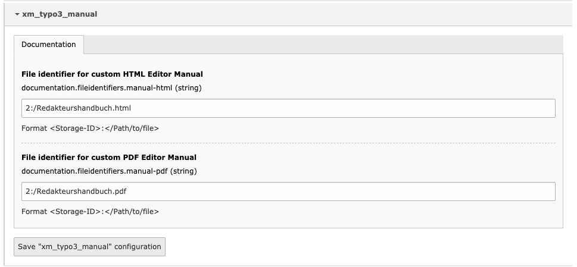

# TYPO3 Extension xm_typo3_manual

## Einleitung

Die Extension stellt ein allgemeines Redakteurshandbuch mittels Toolbar-Item im TYPO3 Backend bereit.

Das vorhandene Handbuch im [AsciiDoc](https://asciidoc.org/) Format kann auch verwendet werden, um ein projektspezifisches zu erstellen. Dazu können die einzelnen allgemeinen Kapitel in das eigene Handbuch eingebunden werden.

## Konfiguration

Um statt des mitgelieferten allgemeinen Handbuchs ein eigenes in der Toolbar zu verlinken, muss dieses in einem TYPO3 FileStorage liegen und kann dann über die Extension Settings als HTML- und PDF-Variante für die Verlinkung konfiguriert werden.

In der User-TSConfig kann zusätzlich über `options.enableManual` gesteuert werden, ob das Handbuch für bestimmte Benutzer verlinkt werden soll oder nicht.

## Entwicklung

@ToDo: Build-Tools in Extension integrieren und dokumentieren
